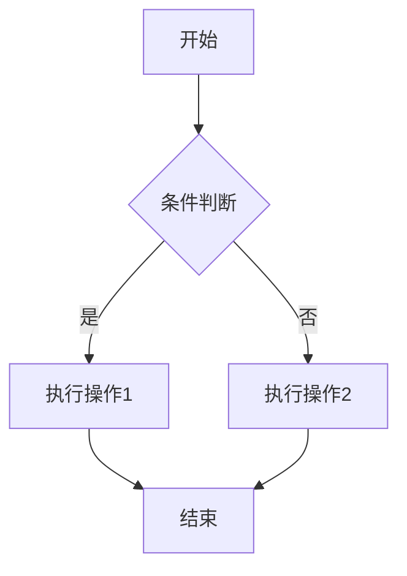
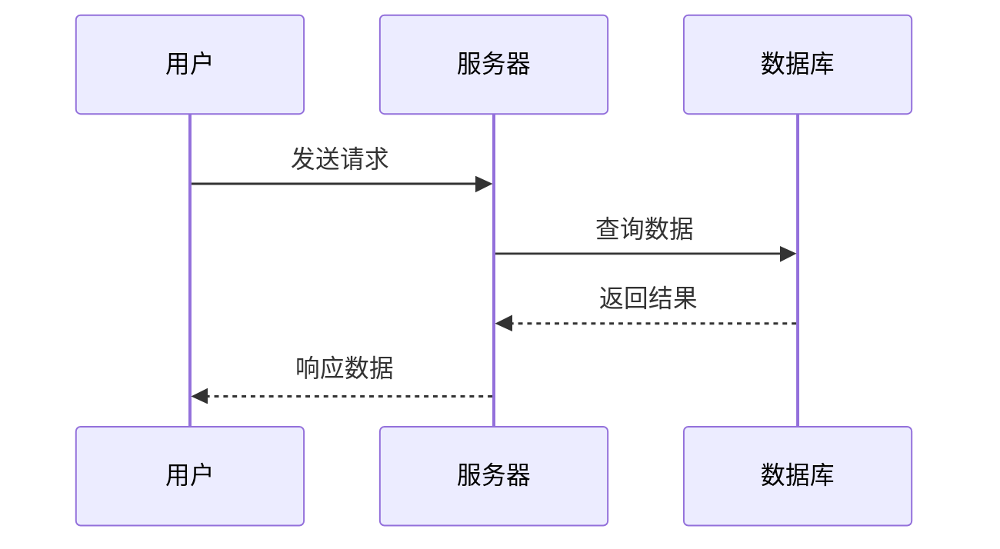
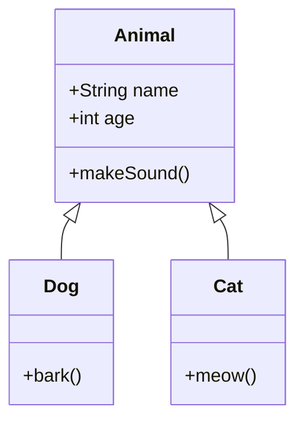
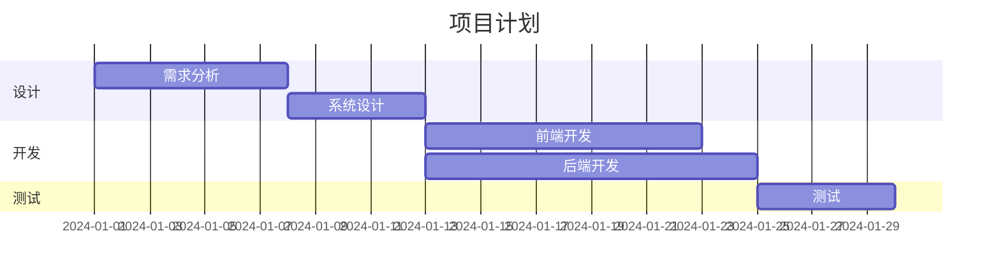
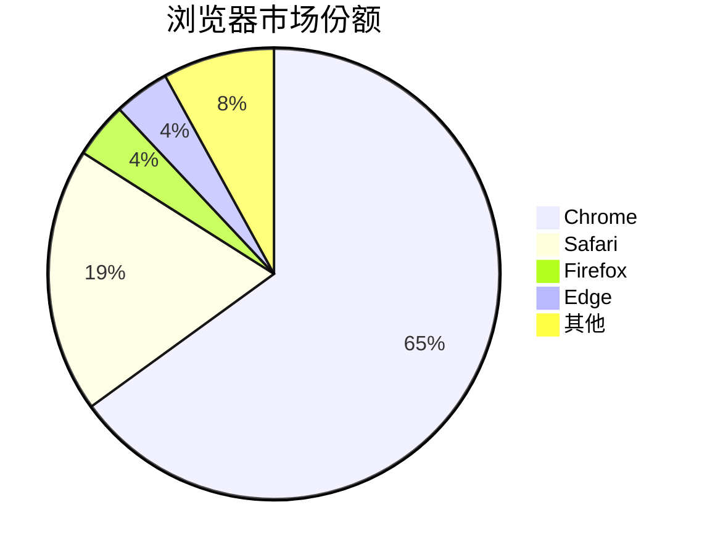
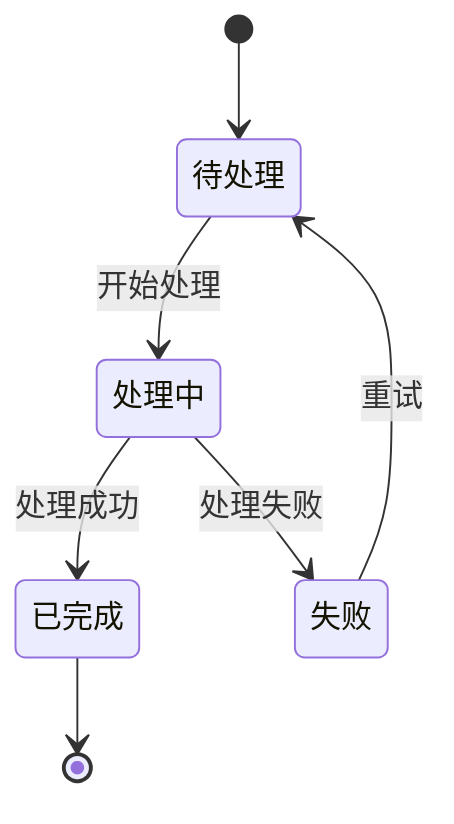
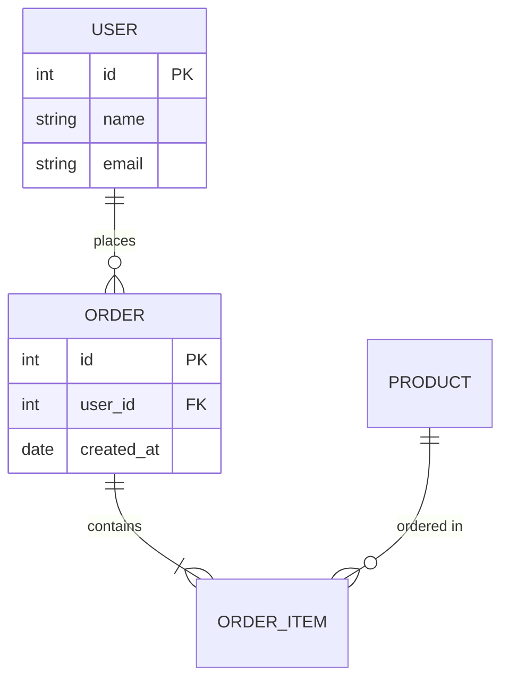

> Markdown 是一种轻量级标记语言，让你用纯文本格式编写文档，然后转换成结构化的 HTML
> 本笔记涵盖标准 Markdown 语法及 GitHub Flavored Markdown (GFM) 扩展

---

## 目录

1. [基础概念](#1-基础概念)
2. [标题与段落](#2-标题与段落)
3. [文本格式化](#3-文本格式化)
4. [列表](#4-列表)
5. [链接与图片](#5-链接与图片)
6. [代码](#6-代码)
7. [引用与分隔线](#7-引用与分隔线)
8. [表格](#8-表格)
9. [任务列表](#9-任务列表)
10. [HTML 混用](#10-html-混用)
11. [高级技巧](#11-高级技巧)
12. [数学公式](#12-数学公式)
13. [流程图与图表](#13-流程图与图表)
14. [最佳实践](#14-最佳实践)
15. [常见错误与解决方案](#15-常见错误与解决方案)

---

## 1. 基础概念

### 1.1 什么是 Markdown？

Markdown 是 John Gruber 在 2004 年创建的一种轻量级标记语言。它的设计理念是"易读易写"——即使不渲染，纯文本状态下也能轻松阅读。

简单来说，Markdown 就是用一些简单的符号（如 `#`、`*`、`-`）来表示文档结构，然后工具会把它转换成漂亮的格式。

**为什么要用 Markdown？**
- **简单**：语法简洁，5分钟就能上手
- **专注**：让你专注于内容而非排版
- **通用**：GitHub、GitLab、Notion、Typora 等都支持
- **可移植**：纯文本格式，任何编辑器都能打开
- **版本控制友好**：与 Git 完美配合

### 1.2 Markdown 变体

| 变体 | 说明 | 使用场景 |
|------|------|---------|
| 标准 Markdown | John Gruber 的原始规范 | 基础文档 |
| GFM | GitHub Flavored Markdown | GitHub 项目文档 |
| CommonMark | 标准化规范 | 跨平台兼容 |
| MDX | Markdown + JSX | React 文档 |
| R Markdown | 支持 R 代码 | 数据分析报告 |

### 1.3 常用编辑器

- **Typora**：所见即所得，体验最佳
- **VS Code**：配合插件功能强大
- **Obsidian**：双向链接，知识管理
- **Mark Text**：开源免费
- **在线**：StackEdit、Dillinger

---

## 2. 标题与段落

### 2.1 标题

Markdown 支持 6 级标题，使用 `#` 符号表示：

```markdown
# 一级标题
## 二级标题
### 三级标题
#### 四级标题
##### 五级标题
###### 六级标题
```

**另一种写法（仅支持一二级）：**
```markdown
一级标题
========

二级标题
--------
```

**注意事项：**
- `#` 后面要加空格
- 标题前后最好空一行
- 一个文档通常只有一个一级标题

### 2.2 段落与换行

**段落**：用空行分隔

```markdown
这是第一段。

这是第二段。
```

**换行**：有两种方式

```markdown
方式一：行末加两个空格  
然后换行

方式二：使用 <br> 标签
第一行<br>第二行
```

**常见错误**：直接回车不会换行！

```markdown
❌ 错误写法：
这是第一行
这是第二行
（渲染后会连在一起）

✅ 正确写法：
这是第一行  
这是第二行
（行末有两个空格）
```

---

## 3. 文本格式化

### 3.1 基础格式

```markdown
*斜体* 或 _斜体_

**粗体** 或 __粗体__

***粗斜体*** 或 ___粗斜体___

~~删除线~~

==高亮==（部分编辑器支持）

<u>下划线</u>（使用 HTML）

上标：X<sup>2</sup>
下标：H<sub>2</sub>O
```

**渲染效果：**
- *斜体*
- **粗体**
- ***粗斜体***
- ~~删除线~~

### 3.2 组合使用

```markdown
这是一段包含 **粗体**、*斜体* 和 ~~删除线~~ 的文本。

你也可以 ***同时使用粗体和斜体***。

甚至可以 ~~**删除的粗体**~~ 或 ~~*删除的斜体*~~。
```

### 3.3 转义字符

当你需要显示 Markdown 语法符号本身时，使用反斜杠 `\` 转义：

```markdown
\*这不是斜体\*
\# 这不是标题
\[这不是链接\]
```

**需要转义的字符：**
```
\   反斜杠
`   反引号
*   星号
_   下划线
{}  花括号
[]  方括号
()  圆括号
#   井号
+   加号
-   减号
.   点
!   感叹号
|   管道符
```

---

## 4. 列表

### 4.1 无序列表

使用 `-`、`*` 或 `+` 作为列表标记：

```markdown
- 项目一
- 项目二
- 项目三

* 项目一
* 项目二

+ 项目一
+ 项目二
```

**建议**：在一个文档中保持一致，推荐使用 `-`

### 4.2 有序列表

```markdown
1. 第一项
2. 第二项
3. 第三项

<!-- 数字不必按顺序，渲染时会自动排序 -->
1. 第一项
1. 第二项
1. 第三项
```

### 4.3 嵌套列表

使用缩进（2或4个空格）创建嵌套：

```markdown
- 水果
  - 苹果
  - 香蕉
    - 进口香蕉
    - 国产香蕉
  - 橙子
- 蔬菜
  - 白菜
  - 萝卜

1. 第一章
   1. 第一节
   2. 第二节
2. 第二章
   - 要点一
   - 要点二
```

### 4.4 列表中的多段落和代码

```markdown
1. 第一项

   这是第一项的第二段落（注意缩进）。

   ```python
   # 这是第一项中的代码块
   print("Hello")
   ```

2. 第二项
```

---

## 5. 链接与图片

### 5.1 链接

**行内链接：**
```markdown
[链接文字](URL)
[Google](https://www.google.com)
[带标题的链接](https://www.google.com "Google 首页")
```

**引用链接（适合多次使用同一链接）：**
```markdown
这是 [Google][1] 和 [GitHub][gh] 的链接。

[1]: https://www.google.com
[gh]: https://github.com "GitHub"
```

**自动链接：**
```markdown
<https://www.google.com>
<example@email.com>
```

**页内锚点链接：**
```markdown
[跳转到标题](#标题名称)
[跳转到基础概念](#1-基础概念)
```

**注意**：锚点链接中，标题会被转换为小写，空格变成 `-`，特殊字符被移除。

### 5.2 图片

**基础语法：**
```markdown


```

**引用方式：**
```markdown
![替代文字][img1]

[img1]: ./images/photo.jpg "图片标题"
```

**带链接的图片：**
```markdown
[](链接URL)
[](https://example.com)
```

**调整图片大小（HTML）：**
```markdown


```

**图片居中（HTML）：**
```markdown
<div align="center">
  
</div>

<!-- 或者 -->
<p align="center">
  
</p>
```

---

## 6. 代码

### 6.1 行内代码

使用反引号包裹：

```markdown
使用 `console.log()` 输出日志。
安装命令：`npm install package-name`
```

**包含反引号的代码：**
```markdown
`` `code` ``  显示为 `code`
```

### 6.2 代码块

**缩进方式（4个空格或1个Tab）：**
```markdown
    function hello() {
        console.log("Hello");
    }
```

**围栏方式（推荐）：**

````markdown
```javascript
function hello() {
    console.log("Hello");
}
```
````

### 6.3 语法高亮

指定语言名称启用语法高亮：

````markdown
```python
def hello():
    print("Hello, World!")
```

```java
public class Hello {
    public static void main(String[] args) {
        System.out.println("Hello");
    }
}
```

```sql
SELECT * FROM users WHERE age > 18;
```

```bash
#!/bin/bash
echo "Hello"
npm install
```

```json
{
  "name": "project",
  "version": "1.0.0"
}
```
````

### 6.4 常用语言标识

| 语言 | 标识 | 语言 | 标识 |
|------|------|------|------|
| JavaScript | `javascript` / `js` | Python | `python` / `py` |
| TypeScript | `typescript` / `ts` | Java | `java` |
| HTML | `html` | CSS | `css` |
| JSON | `json` | YAML | `yaml` / `yml` |
| Bash | `bash` / `shell` | SQL | `sql` |
| C | `c` | C++ | `cpp` |
| Go | `go` | Rust | `rust` |
| Markdown | `markdown` / `md` | Diff | `diff` |

### 6.5 Diff 代码对比

````markdown
```diff
- 这行被删除了
+ 这行是新增的
  这行没有变化
```
````

渲染效果会用红色显示删除，绿色显示新增。

---

## 7. 引用与分隔线

### 7.1 引用

使用 `>` 创建引用块：

```markdown
> 这是一段引用文字。
> 可以跨多行。

> 这是另一段引用。
```

**嵌套引用：**
```markdown
> 一级引用
>> 二级引用
>>> 三级引用
```

**引用中包含其他元素：**
```markdown
> ### 引用中的标题
> 
> - 列表项一
> - 列表项二
> 
> 包含 **粗体** 和 `代码`。
```

**常见用途：**
- 引用他人的话
- 重要提示或警告
- 邮件回复样式

### 7.2 分隔线

三种方式创建分隔线：

```markdown
---

***

___
```

**注意**：分隔线前后最好空一行，避免被解析为标题。

---

## 8. 表格

### 8.1 基础表格

```markdown
| 表头1 | 表头2 | 表头3 |
|-------|-------|-------|
| 单元格 | 单元格 | 单元格 |
| 单元格 | 单元格 | 单元格 |
```

### 8.2 对齐方式

```markdown
| 左对齐 | 居中对齐 | 右对齐 |
|:-------|:-------:|-------:|
| 左 | 中 | 右 |
| Left | Center | Right |
```

- `:---` 左对齐
- `:---:` 居中
- `---:` 右对齐

### 8.3 表格技巧

**简化写法（不必对齐）：**
```markdown
|名称|价格|数量|
|---|---|---|
|苹果|5|10|
|香蕉|3|20|
```

**表格中使用格式：**
```markdown
| 功能 | 状态 | 说明 |
|------|------|------|
| 登录 | ✅ | **已完成** |
| 注册 | ⏳ | *进行中* |
| 支付 | ❌ | `待开发` |
```

**表格中使用代码：**
```markdown
| 方法 | 示例 |
|------|------|
| GET | `curl http://api.com` |
| POST | `curl -X POST http://api.com` |
```

**表格中换行：**
```markdown
| 列1 | 列2 |
|-----|-----|
| 第一行<br>第二行 | 内容 |
```

---

## 9. 任务列表

### 9.1 基础任务列表

```markdown
- [x] 已完成任务
- [ ] 未完成任务
- [ ] 另一个待办事项
```

渲染效果：
- [x] 已完成任务
- [ ] 未完成任务
- [ ] 另一个待办事项

### 9.2 嵌套任务列表

```markdown
- [ ] 项目开发
  - [x] 需求分析
  - [x] 系统设计
  - [ ] 编码实现
    - [x] 前端开发
    - [ ] 后端开发
  - [ ] 测试
- [ ] 项目部署
```

### 9.3 任务列表应用场景

**项目进度追踪：**
```markdown
## Sprint 1 进度

- [x] 用户登录功能
- [x] 用户注册功能
- [ ] 密码找回功能
- [ ] 第三方登录

完成度：2/4 (50%)
```

**会议待办：**
```markdown
## 2024-01-15 会议纪要

### 待办事项
- [ ] @张三 完成接口文档
- [ ] @李四 修复登录 Bug
- [x] @王五 更新测试用例
```

---

## 10. HTML 混用

Markdown 支持直接使用 HTML 标签，这在需要更复杂格式时非常有用。

### 10.1 常用 HTML 标签

**文本样式：**
```markdown
<span style="color: red;">红色文字</span>
<span style="color: #007bff;">蓝色文字</span>
<mark>高亮文字</mark>
<kbd>Ctrl</kbd> + <kbd>C</kbd>
<small>小号文字</small>
<sup>上标</sup> 和 <sub>下标</sub>
```

**折叠内容：**
```markdown
<details>
<summary>点击展开详情</summary>

这里是隐藏的内容。

可以包含任何 Markdown 格式：
- 列表
- **粗体**
- `代码`

</details>
```

**居中对齐：**
```markdown
<div align="center">

# 居中的标题

这段文字也是居中的。

</div>
```

### 10.2 注释

```markdown
<!-- 这是注释，不会被渲染 -->

<!--
多行注释
可以写很多内容
-->

[//]: # (这也是一种注释方式)
[comment]: <> (另一种注释)
```

### 10.3 锚点定义

```markdown
<a id="custom-anchor"></a>
## 自定义锚点的标题

[跳转到自定义锚点](#custom-anchor)
```

### 10.4 视频嵌入

```markdown
<!-- YouTube -->
<iframe width="560" height="315" 
  src="https://www.youtube.com/embed/VIDEO_ID" 
  frameborder="0" allowfullscreen>
</iframe>

<!-- Bilibili -->
<iframe src="//player.bilibili.com/player.html?bvid=BV1xx411c7mD" 
  width="640" height="360" frameborder="0" allowfullscreen>
</iframe>
```

---

## 11. 高级技巧

### 11.1 脚注

```markdown
这是一段带有脚注的文字[^1]。

这里还有另一个脚注[^note]。

[^1]: 这是第一个脚注的内容。
[^note]: 这是命名脚注的内容，可以包含多行。
    缩进的内容也属于这个脚注。
```

### 11.2 定义列表

部分 Markdown 解析器支持：

```markdown
术语 1
: 定义 1

术语 2
: 定义 2a
: 定义 2b
```

### 11.3 缩写

```markdown
HTML 是一种标记语言。

*[HTML]: HyperText Markup Language
```

鼠标悬停在 HTML 上会显示完整名称。

### 11.4 Emoji 表情

**直接使用 Unicode：**
```markdown
我喜欢 🍎 和 🍌
```

**使用短代码（GitHub 支持）：**
```markdown
:smile: :heart: :thumbsup: :rocket:
:white_check_mark: :x: :warning:
```

**常用 Emoji：**
| 短代码 | 表情 | 短代码 | 表情 |
|--------|------|--------|------|
| `:smile:` | 😄 | `:heart:` | ❤️ |
| `:thumbsup:` | 👍 | `:thumbsdown:` | 👎 |
| `:star:` | ⭐ | `:fire:` | 🔥 |
| `:bug:` | 🐛 | `:rocket:` | 🚀 |
| `:white_check_mark:` | ✅ | `:x:` | ❌ |
| `:warning:` | ⚠️ | `:bulb:` | 💡 |

### 11.5 徽章（Badge）

常用于 GitHub README：

```markdown


<!-- 动态徽章 -->


```

### 11.6 目录生成

**手动目录：**
```markdown
## 目录

- [简介](#简介)
- [安装](#安装)
- [使用方法](#使用方法)
```

**自动目录（部分平台支持）：**
```markdown
[[toc]]

<!-- 或者 -->
[TOC]

<!-- GitHub 不支持自动目录，需要手动创建 -->
```

---

## 12. 数学公式

### 12.1 LaTeX 公式

需要平台支持（如 GitHub、Typora、Obsidian）。

**行内公式：**
```markdown
质能方程：$E = mc^2$

勾股定理：$a^2 + b^2 = c^2$
```

**块级公式：**
```markdown
$$
\sum_{i=1}^{n} x_i = x_1 + x_2 + \cdots + x_n
$$

$$
\frac{-b \pm \sqrt{b^2 - 4ac}}{2a}
$$
```

### 12.2 常用数学符号

```markdown
<!-- 上下标 -->
$x^2$, $x_i$, $x_i^2$

<!-- 分数 -->
$\frac{a}{b}$, $\dfrac{a}{b}$

<!-- 根号 -->
$\sqrt{x}$, $\sqrt[3]{x}$

<!-- 求和与积分 -->
$\sum_{i=1}^{n}$, $\int_0^1 f(x)dx$

<!-- 希腊字母 -->
$\alpha$, $\beta$, $\gamma$, $\delta$, $\pi$, $\theta$

<!-- 关系符号 -->
$\leq$, $\geq$, $\neq$, $\approx$, $\equiv$

<!-- 集合 -->
$\in$, $\notin$, $\subset$, $\cup$, $\cap$

<!-- 箭头 -->
$\rightarrow$, $\leftarrow$, $\Rightarrow$, $\Leftrightarrow$

<!-- 矩阵 -->
$$
\begin{pmatrix}
a & b \\
c & d
\end{pmatrix}
$$
```

---

## 13. 流程图与图表

### 13.1 Mermaid 流程图

Mermaid 是一种基于文本的图表工具，GitHub、GitLab、Typora 等都支持。

**流程图：**
````markdown

````

**时序图：**
````markdown

````

**类图：**
````markdown

````

**甘特图：**
````markdown

````

**饼图：**
````markdown

````

### 13.2 状态图

````markdown

````

### 13.3 ER 图

````markdown

````

---

## 14. 最佳实践

### 14.1 文档结构

```markdown
# 项目名称

简短的项目描述（一两句话）。

## 目录

- [特性](#特性)
- [安装](#安装)
- [使用方法](#使用方法)
- [配置](#配置)
- [贡献指南](#贡献指南)
- [许可证](#许可证)

## 特性

- ✨ 特性一
- 🚀 特性二
- 🔧 特性三

## 安装

```bash
npm install package-name
```

## 使用方法

```javascript
import { something } from 'package-name';
```

## 配置

| 参数 | 类型 | 默认值 | 说明 |
|------|------|--------|------|
| option1 | string | '' | 说明 |

## 贡献指南

欢迎提交 Issue 和 Pull Request。

## 许可证

MIT
```

### 14.2 写作规范

**标题规范：**
- 一个文档只有一个一级标题
- 标题层级不要跳跃（如从 h2 直接到 h4）
- 标题要简洁明了

**段落规范：**
- 段落之间空一行
- 一个段落不要太长，适当分段
- 中英文之间加空格

**列表规范：**
- 列表项保持并列关系
- 同一列表使用相同的标记符号
- 嵌套不要超过3层

**代码规范：**
- 行内代码用于短代码、命令、文件名
- 代码块用于多行代码
- 始终指定语言以启用高亮

### 14.3 中文排版

```markdown
<!-- 中英文之间加空格 -->
✅ 使用 GitHub 进行版本控制
❌ 使用GitHub进行版本控制

<!-- 中文与数字之间加空格 -->
✅ 今天是 2024 年 1 月 15 日
❌ 今天是2024年1月15日

<!-- 使用全角标点 -->
✅ 你好，世界！
❌ 你好,世界!

<!-- 专有名词保持原样 -->
✅ 使用 JavaScript 开发
❌ 使用 javascript 开发
```

---

## 15. 常见错误与解决方案

### 15.1 格式不生效

**问题：粗体/斜体不生效**
```markdown
❌ 错误：
**粗体**文字  （符号与文字之间有空格）
* 斜体*       （符号不对称）

✅ 正确：
**粗体**文字
*斜体*
```

**问题：列表不生效**
```markdown
❌ 错误：
-项目一      （减号后没有空格）
1.项目一     （点号后没有空格）

✅ 正确：
- 项目一
1. 项目一
```

**问题：代码块不生效**
````markdown
❌ 错误：
```                （反引号前有空格）
code
```

✅ 正确：
```
code
```
````

### 15.2 换行问题

**问题：换行不生效**
```markdown
❌ 错误：
第一行
第二行
（渲染后会连在一起）

✅ 正确方式一（行末两个空格）：
第一行  
第二行

✅ 正确方式二（使用 <br>）：
第一行<br>第二行

✅ 正确方式三（空行分段）：
第一行

第二行
```

### 15.3 链接问题

**问题：链接中有特殊字符**
```markdown
❌ 错误：
[链接](https://example.com/path?a=1&b=2)  （可能解析错误）

✅ 正确：
[链接](https://example.com/path?a=1&b=2)  （URL 编码）
[链接](<https://example.com/path?a=1&b=2>)  （用尖括号包裹）
```

**问题：链接中有括号**
```markdown
❌ 错误：
[Wikipedia](https://en.wikipedia.org/wiki/Markdown_(markup_language))

✅ 正确：
[Wikipedia](https://en.wikipedia.org/wiki/Markdown_\(markup_language\))
[Wikipedia](<https://en.wikipedia.org/wiki/Markdown_(markup_language)>)
```

**问题：锚点链接不工作**
```markdown
<!-- 标题 -->
## 1. 基础概念

❌ 错误的锚点：
[跳转](#1. 基础概念)
[跳转](#1.基础概念)

✅ 正确的锚点：
[跳转](#1-基础概念)
<!-- 规则：小写、空格变横杠、移除特殊字符 -->
```

### 15.4 表格问题

**问题：表格不渲染**
```markdown
❌ 错误：
|表头1|表头2|
|内容1|内容2|
（缺少分隔行）

✅ 正确：
|表头1|表头2|
|-----|-----|
|内容1|内容2|
```

**问题：表格中使用管道符**
```markdown
❌ 错误：
| 命令 | 说明 |
|------|------|
| a | b | 显示 a 或 b |  （管道符被解析为列分隔）

✅ 正确：
| 命令 | 说明 |
|------|------|
| a \| b | 显示 a 或 b |  （转义管道符）
| `a | b` | 显示 a 或 b |  （放在代码中）
```

### 15.5 嵌套问题

**问题：列表中的代码块**
````markdown
❌ 错误：
- 列表项
```
代码
```
（代码块没有正确缩进）

✅ 正确：
- 列表项

  ```
  代码
  ```
  （代码块缩进与列表内容对齐）
````

**问题：引用中的代码块**
````markdown
❌ 错误：
> 引用
```
代码
```

✅ 正确：
> 引用
> ```
> 代码
> ```
````

### 15.6 图片问题

**问题：图片不显示**
```markdown
<!-- 检查清单 -->
1. 路径是否正确？（相对路径 vs 绝对路径）
2. 文件名大小写是否匹配？（Linux 区分大小写）
3. 文件是否存在？
4. 网络图片 URL 是否有效？
5. 是否有防盗链？

<!-- 相对路径示例 -->
     <!-- 当前目录下的 images 文件夹 -->
    <!-- 上级目录下的 images 文件夹 -->
      <!-- 根目录下的 images 文件夹 -->
```

**问题：图片太大**
```markdown
<!-- 使用 HTML 控制大小 -->


```

### 15.7 平台兼容性问题

**问题：某些语法在特定平台不支持**

| 功能 | GitHub | GitLab | Typora | VS Code |
|------|--------|--------|--------|---------|
| 任务列表 | ✅ | ✅ | ✅ | ✅ |
| 表格 | ✅ | ✅ | ✅ | ✅ |
| 脚注 | ✅ | ✅ | ✅ | 插件 |
| 数学公式 | ✅ | ✅ | ✅ | 插件 |
| Mermaid | ✅ | ✅ | ✅ | 插件 |
| 高亮 `==text==` | ❌ | ❌ | ✅ | 插件 |
| 自动目录 `[TOC]` | ❌ | ✅ | ✅ | 插件 |

**解决方案**：使用最通用的语法，或针对目标平台调整。

---

## 附录：语法速查表

```markdown
# 标题
## 二级标题

**粗体** *斜体* ~~删除线~~ `代码`

- 无序列表
1. 有序列表
- [ ] 任务列表

[链接](URL)


> 引用

---

| 表头 | 表头 |
|------|------|
| 内容 | 内容 |

```语言
代码块
```

脚注[^1]
[^1]: 脚注内容
```

---

> 💡 **学习建议**：
> 1. 从基础语法开始，多写多练
> 2. 选择一个顺手的编辑器（推荐 Typora 或 VS Code）
> 3. 了解目标平台支持的语法特性
> 4. 保持文档结构清晰，善用标题和列表
> 5. 遵循中文排版规范，提升可读性
