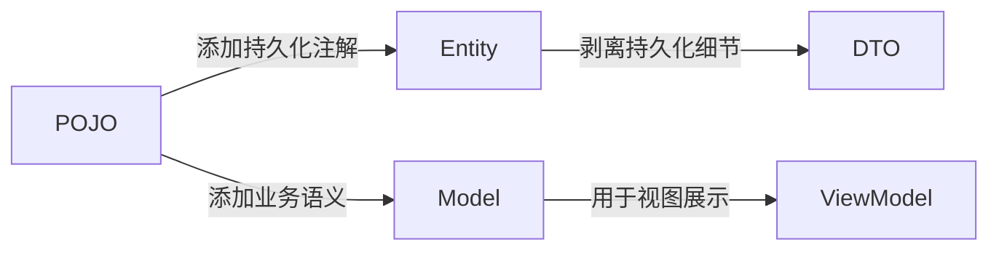
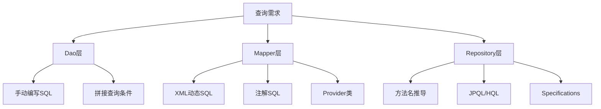
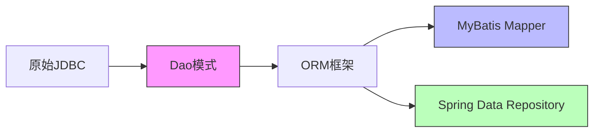
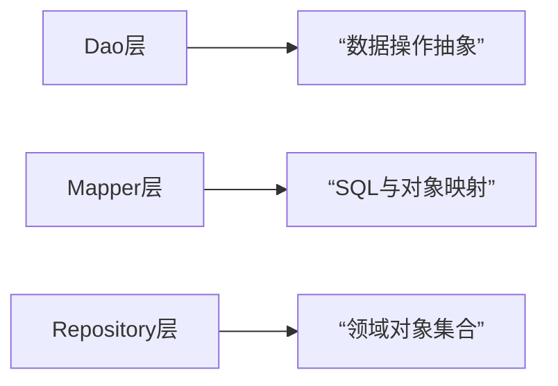

# 版本选择
## Java版本选择
截至2025年，Java的LTS（长期支持）版本主要包括**JDK 8、JDK 11、JDK 17和JDK 21**。这些版本在支持周期、特性、性能及生态兼容性上差异显著。以下是综合对比分析：

---

###  **一、支持周期与维护状态**
| **版本** | **发布时间** | **免费支持结束** | **扩展支持** | **当前状态** |
|----------|--------------|------------------|--------------|--------------|
| **JDK 21** (最新LTS) | 2023年9月 | 2031年9月 | 商业支持至2036年 | ✅ 主流支持中  |
| **JDK 17** | 2021年9月 | 2029年9月 | 商业支持至2034年 | ✅ 稳定支持中  |
| **JDK 11** | 2018年9月 | 2026年9月 | 需付费订阅 | ⚠️ 维护末期，企业需付费  |
| **JDK 8** | 2014年3月 | 2019年1月 | 付费支持至2030年 | ❌ 无免费更新，安全风险高  |

> **关键点**：  
> - **JDK 21** 是支持周期最长的LTS（8年免费支持），适合长期项目。  
> - **JDK 8** 已无免费安全更新，仅建议遗留系统临时使用。

---

### **二、核心特性与技术创新**
#### **1. JDK 21：革命性并发与内存优化**
- **虚拟线程（正式版）**：轻量级线程模型，支持百万级并发连接，吞吐量提升30%+，尤其适合微服务。
- **分代ZGC**：降低GC暂停时间40%，内存占用减少35%，云原生场景性能显著优化。
- **序列化集合 & 模式匹配**：简化数据操作，增强代码可读性（如`switch`模式匹配）。

#### **2. JDK 17：现代化语言与安全增强**
- **密封类（Sealed Classes）**：限制类继承，提升代码安全性。
- **ZGC优化**：支持TB级堆内存，低延迟垃圾回收。
- **移除SecurityManager**：简化安全模型，减少性能开销。

#### **3. JDK 11：基础能力升级**
- **HTTP Client API**：支持异步请求，替代传统`HttpURLConnection`。
- **ZGC（实验版）**：首次引入低延迟GC，但稳定性不及后续版本。

#### **4. JDK 8：经典但过时**
- **Lambda表达式 & Stream API**：函数式编程基石，但缺乏现代并发与内存管理特性。

---

### **三、性能对比（企业级场景）**
| **指标** | **JDK 21** | **JDK 17** | **JDK 11** | **JDK 8** |
|----------|------------|------------|------------|-----------|
| **高并发吞吐量** | ⭐⭐⭐⭐ (虚拟线程) | ⭐⭐ (传统线程池) | ⭐ (有限优化) | ❌ |
| **GC暂停时间** | <1ms (分代ZGC) | 2-10ms (ZGC) | 10-50ms (G1) | 100ms+ (CMS) |
| **启动速度** | 提升50% (AOT预热) | 提升30% | 提升15% | 基准 |
| **内存占用** | 降低35% (紧凑对象头) | 降低20% | 无显著优化 | 高 |

> 💡 **数据来源**：Azul基准测试显示，JDK 21比JDK 11快36%，比JDK 17快15%。

---

###  **四、生态系统兼容性**
- **Spring Boot**：  
  - JDK 21：需Spring Boot 3.2+（全面适配虚拟线程）。  
  - JDK 17：兼容Spring Boot 2.7+，主流企业框架已验证。  
  - JDK 8：仅支持Spring Boot 2.x，新特性受限。  
- **云原生部署**：  
  - JDK 21的轻量级虚拟线程更契合Kubernetes资源调度，容器化效率提升40%。  
- **监控工具**：  
  - JDK 17+支持JDK Flight Recorder细粒度诊断，而JDK 11功能有限。

---

###  **五、选型建议**
1. **新项目**：**JDK 21**（LTS至2031年），直接应用虚拟线程、分代ZGC等革新特性，面向云原生设计。  
2. **旧系统升级**：  
   - 若原用JDK 8 → 优先迁移至 **JDK 17**（平衡稳定性与特性）。  
   - 若原用JDK 11 → 直接升级 **JDK 21**（规避二次迁移成本）。  
3. **强制保留JDK 8的场景**：  
   - 需购买商业支持（如Oracle扩展服务），并严格隔离网络以减少攻击面。

---

###  **总结：LTS版本核心价值对比**
| **维度**       | **JDK 21**              | **JDK 17**             | **JDK 11**             | **JDK 8**             |
|----------------|-------------------------|------------------------|------------------------|-----------------------|
| **技术前瞻性** | ⭐⭐⭐⭐⭐ (虚拟线程、AI支持) | ⭐⭐⭐ (密封类)          | ⭐⭐ (HTTP Client)       | ⭐ (Lambda)           |
| **生产稳定性** | ⭐⭐⭐⭐ (成熟分代ZGC)      | ⭐⭐⭐⭐ (广泛验证)       | ⭐⭐⭐ (末期维护)         | ⭐ (高风险)           |
| **升级成本**   | ⭐⭐ (需验证框架)         | ⭐⭐⭐ (平滑过渡)        | ⭐⭐⭐⭐ (低风险)          | ⭐⭐⭐⭐⭐ (无需迁移)     |
| **长期价值**   | ⭐⭐⭐⭐⭐ (支持至2031年)    | ⭐⭐⭐⭐ (支持至2029年)   | ⭐⭐ (2026年结束)        | ❌ (已结束)           |


## SpringBoot版本选择
截至2025年，Spring Boot的长期支持（LTS）版本主要包括 **Spring Boot 2.7.x**、**3.1.x** 和 **3.2.x**。以下是各版本的详细对比分析，结合支持周期、技术特性、生产适用性等维度：

---

###  **一、LTS版本支持周期**
| **版本**       | **免费支持结束时间** | **商业支持结束时间** | **当前状态**       |
|----------------|----------------------|----------------------|--------------------|
| **Spring Boot 2.7.x** | 2023年11月（基础）<br>商业支持至2025年5月 | 2025年5月 | 维护末期，仅安全更新 |
| **Spring Boot 3.1.x** | 2024年5月（基础）<br>商业支持至2025年8月 | 2025年8月 | 稳定支持中         |
| **Spring Boot 3.2.x** | 2024年11月（基础）<br>商业支持至2026年2月 | 2026年2月 | 主流支持中         |

> **关键点**：  
> - **Spring Boot 2.7.x**：是最后一个支持JDK 8的LTS版本，适合遗留系统维护。  
> - **Spring Boot 3.2.x**：支持周期最长，兼容JDK 17-21，是未来3年的技术主力。

---

###  **二、技术特性与兼容性**
#### **1. JDK 兼容性**
| **版本**       | **最低JDK要求** | **推荐JDK** | **兼容范围**       |
|----------------|-----------------|-------------|--------------------|
| 2.7.x          | JDK 8           | JDK 11      | JDK 8-19 |
| 3.1.x          | JDK 17          | JDK 17      | JDK 17-20 |
| 3.2.x          | JDK 17          | JDK 21      | JDK 17-25 |

> **说明**：  
> - Spring Boot 3.x 强制要求 **JDK 17+**，因底层依赖 Jakarta EE 9+（包名从 `javax` 迁移至 `jakarta`）。  
> - JDK 21 是LTS版本，支持虚拟线程（Project Loom）、分代ZGC等特性，显著提升云原生性能。

#### **2. 核心特性对比**
| **特性**               | **2.7.x**                  | **3.1.x**                  | **3.2.x**                  |
|------------------------|----------------------------|----------------------------|----------------------------|
| **云原生支持**         | 有限（需手动配置）         | GraalVM原生镜像（实验性）  | GraalVM优化 + AOT编译成熟  |
| **安全框架**           | Spring Security 5.7        | Spring Security 6.1+       | 集成OAuth 2.1、OIDC 1.0    |
| **监控与可观测性**     | Actuator + Micrometer      | OpenTelemetry集成          | 强化分布式追踪与指标导出   |
| **API管理**            | 无原生版本控制             | 无                         | 支持注解式API版本路由 |
| **开发效率**           | 传统启动（较慢）           | 启动速度提升30%            | 启动<1秒（原生镜像） |

---

###  **三、生产环境适用场景**
#### **1. Spring Boot 2.7.x**  
- **适用场景**：  
  - 依赖JDK 8或JDK 11的遗留系统。  
  - 第三方库未适配Spring Boot 3.x（如旧版MyBatis、Netflix OSS）。  
- **风险提示**：  
  - 2025年5月后无官方安全更新，需购买商业支持或迁移。

#### **2. Spring Boot 3.1.x**  
- **适用场景**：  
  - 已升级JDK 17的中型项目，需平衡稳定性与新特性。  
  - 兼容Spring Cloud 2022.0.x（如Kilburn）。  
- **局限**：  
  - GraalVM支持不完善，原生镜像构建成功率较低。

#### **3. Spring Boot 3.2.x**  
- **适用场景**：  
  - 新项目或深度云原生架构（如Kubernetes部署）。  
  - 需利用虚拟线程实现高并发（百万级连接）。  
- **优势**：  
  - 完美兼容JDK 21，内存占用降低40%，启动时间缩短至毫秒级。

---

###  **四、综合对比与选型建议**
| **维度**         | **2.7.x**       | **3.1.x**       | **3.2.x**         |
|------------------|-----------------|-----------------|-------------------|
| **长期价值**     | ⭐⭐ (即将淘汰)   | ⭐⭐⭐ (过渡选择)  | ⭐⭐⭐⭐⭐ (未来主流) |
| **性能提升**     | 基准            | 30%             | 50%+              |
| **迁移成本**     | 低（无需升级JDK）| 中（需JDK 17）  | 高（需JDK 17+）   |
| **生态兼容性**   | 成熟但陈旧      | 部分适配新组件  | 全面兼容云原生栈  |


###  **总结建议**
1. **新项目**：**Spring Boot 3.2.x + JDK 21**  
   - 理由：最大化利用虚拟线程、GraalVM原生镜像、分代ZGC等革新特性，支持至2026年。  
2. **旧系统升级**：  
   - 若需保留JDK 8 → **Spring Boot 2.7.x**（2025年5月前需迁移完成）。  
   - 若可升级JDK 17 → **Spring Boot 3.2.x**（规避二次迁移成本）。  
3. **云原生改造**：  
   - 优先采用Spring Boot 3.2.x的AOT编译与原生镜像，减少50%内存占用并实现秒级扩容。  


# 包结构设计
Spring Boot 应用的包结构设计对于代码的可读性、可维护性和可扩展性至关重要。以下是几种常见且推荐的设计模式：

---

### **1. 经典的 MVC 分层设计 (最常见)**
这是最基础、最广泛使用的模式，按技术职责分层：

```lua
com.example.app
├── application            (可选，应用服务层)
├── controller             (Web 层 - 处理 HTTP 请求/响应)
│   ├── api                (对外 API 接口)
│   └── web                (传统 MVC 或页面渲染控制器)
├── service                (业务逻辑层 - 核心业务实现)
│   ├── impl               (Service 接口的实现类)
├── repository             (或 dao) (数据访问层 - 数据库操作)
│   ├── entity             (或 model/domain) (实体类 - JPA 或 MyBatis 实体)
├── dto                    (数据传输对象 - 用于层间数据传输)
├── config                 (配置类 - Spring 配置、安全配置等)
├── exception              (自定义异常处理)
├── util                   (工具类 - 静态辅助方法)
└── Application.java       (主启动类)
```

**优点：** 结构清晰，职责分明，易于上手，适合中小型项目。  
**缺点：** 大型项目中业务模块混杂，可能导致包内文件过多。

---

### **2. 模块化设计 (按业务功能拆分)**
**核心思想：按业务领域划分模块，每个模块内包含自己的 MVC 结构。** 适合复杂系统或领域驱动设计（DDD）。

```lua
com.example.app
├── module
│   ├── user                      (用户模块)
│   │   ├── controller            (用户相关控制器)
│   │   ├── service               (用户业务逻辑)
│   │   ├── repository            (用户数据访问)
│   │   ├── dto                   (用户模块专用 DTO)
│   │   └── entity                (用户实体)
│   │
│   ├── product                   (产品模块)
│   │   ├── controller            (产品相关控制器)
│   │   ├── service               (产品业务逻辑)
│   │   └── ...                   (其他层级)
│   │
│   └── order                     (订单模块)
│       ├── controller            (订单控制器)
│       ├── service               (订单逻辑)
│       └── ...                   (其他层级)
│
├── common                        (公共模块)
│   ├── util                      (全局工具类)
│   ├── config                    (全局配置)
│   ├── exception                 (全局异常处理)
│   └── security                  (安全相关)
│
└── Application.java              (主启动类)
```

**优点：**
- **高内聚低耦合**：业务功能高度内聚在模块内，模块间通过接口交互。
- **易于扩展**：新增业务时直接添加新模块。
- **团队协作**：不同团队可负责不同模块。
- **适合微服务拆分**：模块可平滑拆分为独立微服务。

**缺点：** 结构稍复杂，需要前期规划。

---

### **3. 分层 + 模块化混合设计**
结合前两者优点，先按业务模块划分，模块内再分层：

```lua
com.example.app
├── user
│   ├── web             (Controller)
│   ├── service         (Service 接口)
│   ├── service/impl    (Service 实现)
│   ├── repository      (DAO)
│   ├── domain          (实体/聚合根)
│   └── dto             (模块内 DTO)
│
├── product
│   ├── web
│   ├── service
│   └── ...
│
├── common              (跨模块公共组件)
│   ├── util
│   ├── config
│   └── exception
│
└── Application.java
```

**适用场景：** 中大型项目，兼具清晰层次和业务隔离。

---

### **4. 六边形架构 / 整洁架构 (适配进阶需求)**
更强调领域核心与外部依赖解耦：

```lua
com.example.app
├── domain                  (核心领域模型 - 纯业务逻辑)
│   ├── model              (实体、值对象、聚合根)
│   └── service            (领域服务 - 核心业务规则)
│
├── application            (应用服务层 - 协调领域对象)
│   ├── service            (用例编排)
│   ├── dto                (应用层DTO)
│   └── event              (领域事件)
│
├── adapter                (适配器 - 对接外部系统)
│   ├── web                (HTTP 适配器 - Controller)
│   ├── persistence        (数据库适配器 - Repository 实现)
│   ├── mq                 (消息队列适配器)
│   └── ...                (其他外部服务适配)
│
├── infrastructure         (基础设施 - 技术细节实现)
│   ├── config             (配置类)
│   ├── util               (技术工具)
│   └── exception          (异常处理)
│
└── Application.java
```

**优点：** 领域核心独立于框架和数据库，便于测试和替换基础设施。  
**缺点：** 学习曲线陡峭，适合复杂领域驱动项目。

---

### **关键设计原则**
1. **单一职责原则 (SRP)**  
   - 每个类/方法只做一件事。
   - 包内职责统一（如 `controller` 只放控制器）。

2. **高内聚低耦合**  
   - 同一模块内的类紧密协作，模块间通过接口交互。

3. **依赖方向一致**  
   - 依赖关系从上到下：`Controller -> Service -> Repository`。
   - 禁止下层依赖上层（如 `Service` 不应依赖 `Controller`）。

4. **公共代码抽象**  
   - 通用工具放入 `common` 或 `util` 包。
   - 跨模块配置放入全局 `config`。

5. **命名一致性**  
   - 包名：小写英文，复数形式（如 `services`, `repositories`）。
   - 类名：明确职责（如 `UserService`, `OrderController`）。

---

### **实际项目建议**
- **中小项目：** 采用 **经典MVC分层** 或 **模块化设计**。
- **大型复杂系统：** 优先选择 **模块化设计** 或 **六边形架构**。
- **微服务准备：** 使用模块化设计，为未来拆分服务做准备。
- **避免过度设计：** 初期不必追求完美架构，随业务演进调整。

> **示例：模块化结构 + 分层 (推荐主流方案)**
> ```lua
> src/main/java
> └── com
>     └── example
>         └── ecommerce
>             ├── order                  (订单模块)
>             │   ├── application        (应用服务)
>             │   ├── domain             (领域模型)
>             │   ├── infrastructure     (数据实现)
>             │   └── presentation       (控制器)
>             │
>             ├── product                (产品模块)
>             │   ├── application
>             │   ├── domain
>             │   └── ...
>             │
>             ├── user                  (用户模块)
>             │   └── ...
>             │
>             ├── common                (公共模块)
>             │   ├── web               (全局异常处理等)
>             │   └── util              (通用工具)
>             │
>             └── EcommerceApplication.java
> ```


# 包MVC的设计
## Entity/Pojo/Model(实体层)
### Entity的设计
设计实体类（Entity）是Spring Boot应用中的核心环节，直接关系到数据持久化和业务逻辑的实现。以下是设计实体类的关键原则、最佳实践和常见模式：

---

#### **一、实体类设计核心原则**
1. **单一职责原则**  
   每个实体类只代表一个业务概念（如 `User`、`Order`、`Product`）

2. **高内聚低耦合**  
   实体类应包含自身属性和相关行为，避免依赖其他业务逻辑

3. **持久化无关性**  
   实体类不应直接依赖持久化框架（如JPA注解属于必要妥协）

4. **充血模型优先**  
   避免贫血模型（仅有getter/setter），应封装相关业务逻辑

---

#### **二、实体类基础结构（JPA示例）**
```java
import javax.persistence.*;
import java.time.LocalDateTime;

@Entity // 标记为JPA实体
@Table(name = "users") // 指定数据库表名
public class User {

    @Id // 主键
    @GeneratedValue(strategy = GenerationType.IDENTITY) // 自增策略
    private Long id;

    @Column(nullable = false, length = 50) // 非空约束+长度限制
    private String username;

    @Column(unique = true, nullable = false) // 唯一约束
    private String email;

    private LocalDateTime createdAt; // 时间类型自动映射

    @Enumerated(EnumType.STRING) // 枚举存储为字符串
    private UserStatus status = UserStatus.ACTIVE;

    // 必须有无参构造函数
    public User() {}

    // 业务构造函数
    public User(String username, String email) {
        this.username = username;
        this.email = email;
        this.createdAt = LocalDateTime.now();
    }

    // -------------------- 业务方法 --------------------
    public void activate() {
        this.status = UserStatus.ACTIVE;
    }

    public boolean isLocked() {
        return status == UserStatus.LOCKED;
    }

    // -------------------- Getter/Setter --------------------
    // 省略其他getter/setter...
}

// 枚举定义
public enum UserStatus {
    ACTIVE, INACTIVE, LOCKED
}
```

---

#### **三、关联关系设计**
##### 1. **一对一关系**（用户-个人资料）
```java
@Entity
public class UserProfile {
    @Id
    private Long id;
    
    @OneToOne
    @MapsId // 共享主键
    @JoinColumn(name = "user_id")
    private User user;
}
```

##### 2. **一对多关系**（订单-订单项）
```java
@Entity
public class Order {
    @Id
    private Long id;
    
    @OneToMany(mappedBy = "order", cascade = CascadeType.ALL, orphanRemoval = true)
    private List<OrderItem> items = new ArrayList<>();
    
    // 添加订单项的业务方法
    public void addItem(OrderItem item) {
        items.add(item);
        item.setOrder(this);
    }
}

@Entity
public class OrderItem {
    @ManyToOne(fetch = FetchType.LAZY) // 延迟加载
    @JoinColumn(name = "order_id")
    private Order order;
}
```

##### 3. **多对多关系**（用户-角色）
```java
@Entity
public class User {
    @ManyToMany
    @JoinTable(
        name = "user_roles",
        joinColumns = @JoinColumn(name = "user_id"),
        inverseJoinColumns = @JoinColumn(name = "role_id")
    )
    private Set<Role> roles = new HashSet<>();
}

@Entity
public class Role {
    @ManyToMany(mappedBy = "roles")
    private Set<User> users;
}
```

---

#### **四、高级设计技巧**
##### 1. **继承策略**
```java
// 单表继承策略
@Entity
@Inheritance(strategy = InheritanceType.SINGLE_TABLE)
@DiscriminatorColumn(name = "payment_type")
public abstract class Payment {
    @Id
    private Long id;
}

@Entity
@DiscriminatorValue("CREDIT_CARD")
public class CreditCardPayment extends Payment {
    private String cardNumber;
}

@Entity
@DiscriminatorValue("PAYPAL")
public class PayPalPayment extends Payment {
    private String email;
}
```

##### 2. **嵌入对象**
```java
@Embeddable // 值对象
public class Address {
    private String street;
    private String city;
    private String zipCode;
}

@Entity
public class User {
    @Embedded
    private Address address;
}
```

##### 3. **审计字段自动填充**
```java
@Entity
@EntityListeners(AuditingEntityListener.class)
public class Order {
    @CreatedDate
    private LocalDateTime createTime;
    
    @LastModifiedDate
    private LocalDateTime updateTime;
    
    @CreatedBy
    private String createdBy;
}
```
配置类添加 `@EnableJpaAuditing`

---

#### **五、验证与约束**
```java
public class User {
    @NotBlank(message = "用户名不能为空")
    @Size(min = 3, max = 20)
    private String username;

    @Email
    @Column(unique = true)
    private String email;

    @Pattern(regexp = "^(?=.*[A-Za-z])(?=.*\\d).{8,}$", 
             message = "密码需包含字母和数字，长度至少8位")
    private String password;
}
```

---

#### **六、DDD领域驱动设计实践**
##### 聚合根设计示例（订单聚合）
```java
// 聚合根
@Entity
public class Order {
    @Id
    private OrderId id; // 值对象作为ID
    
    @OneToMany(cascade = CascadeType.ALL, orphanRemoval = true)
    private List<OrderItem> items;
    
    // 领域方法
    public void addProduct(Product product, int quantity) {
        // 业务规则验证
        if (product.isOutOfStock()) {
            throw new DomainException("商品已售罄");
        }
        items.add(new OrderItem(product, quantity));
    }
    
    public BigDecimal calculateTotal() {
        return items.stream()
                   .map(OrderItem::getSubtotal)
                   .reduce(BigDecimal.ZERO, BigDecimal::add);
    }
}

// 值对象
@Embeddable
public class OrderId implements Serializable {
    private String value;
    
    public OrderId(String value) {
        this.value = value;
    }
}
```

---

#### **七、需要避免的常见错误**
1. **贫血模型**  
   ❌ 只有getter/setter的纯数据结构  
   ✅ 封装领域逻辑（如 `order.cancel()`）

2. **过度暴露实现细节**  
   ❌ public setter暴露所有字段  
   ✅ 通过构造函数和业务方法控制状态变更

3. **忽略聚合根边界**  
   ❌ 从外部直接修改聚合内的子实体  
   ✅ 通过聚合根的方法修改内部状态

4. **忽略并发控制**  
   ```java
   @Version // 乐观锁控制
   private Long version;
   ```

---

#### **八、实体类设计检查清单**
| 项目                  | 是否完成 |
|-----------------------|----------|
| 主键设计合理          | ☐        |
| 字段约束（非空/唯一） | ☐        |
| 关联关系配置正确      | ☐        |
| 必要的业务方法        | ☐        |
| 验证注解完整          | ☐        |
| 审计字段              | ☐        |
| 线程安全（乐观锁）    | ☐        |
| 测试覆盖核心逻辑      | ☐        |

> **最佳实践建议**：  
> 1. **简单业务**：使用基础JPA实体 + 验证注解  
> 2. **复杂领域**：采用DDD聚合根设计  
> 3. **高频访问**：考虑添加缓存注解（如`@Cacheable`）  
> 4. **历史追踪**：使用`@EntityListeners`实现审计日志  
> 5. **安全敏感**：DTO转换时过滤敏感字段（如密码）
### Entity,Pojo,Model的区别
在Java开发中，`Entity`、`POJO`和`Model`是三个经常被提及但容易混淆的概念。它们在不同场景下有明确的区别和用途：

---

#### **1. POJO (Plain Old Java Object)**
**定义**：最基础的Java对象，不受任何框架约束的普通Java类  
**特点**：
- 不继承特定类
- 不实现特定接口
- 不使用特殊注解
- 只有属性+getter/setter
- 可包含简单业务逻辑

**示例**：
```java
public class User {
    private String name;
    private int age;
    
    // 标准getter/setter
    public String getName() { return name; }
    public void setName(String name) { this.name = name; }
    
    // 可包含简单业务方法
    public boolean isAdult() {
        return age >= 18;
    }
}
```

**使用场景**：
- 数据临时载体
- 跨层数据传输
- 简单值对象

---

#### **2. Entity (实体)**
**定义**：**带有持久化语义**的POJO，直接映射数据库表结构  
**特点**：
- 包含持久化框架注解（JPA/Hibernate等）
- 代表数据库中的表记录
- 通常包含ID主键
- 定义表关联关系

**示例**：
```java
@Entity
@Table(name = "users")
public class User {
    @Id
    @GeneratedValue(strategy = GenerationType.IDENTITY)
    private Long id;
    
    @Column(nullable = false, length = 50)
    private String name;
    
    @OneToMany(mappedBy = "user")
    private List<Order> orders;
    
    // JPA要求有无参构造
    public User() {}
}
```

**使用场景**：
- ORM框架数据库操作
- 领域模型核心
- 数据库表映射

---

#### **3. Model (模型)**
**定义**：**业务语义**的抽象表示，用于特定场景的数据封装  
**特点**：
- 无固定形式（可能是POJO/DTO）
- 包含业务逻辑状态
- 通常与架构层相关（MVC/DDD）
- 可能包含视图展示逻辑

**常见类型**：

| 类型          | 用途                          | 示例                |
|---------------|-------------------------------|---------------------|
| **Domain Model** | 领域业务核心                  | DDD中的聚合根       |
| **View Model**  | 前端展示专用                  | 包含格式化日期字段  |
| **Request Model** | 接收API参数                   | 用户注册请求体      |
| **Response Model** | API返回数据结构              | 包含分页信息的响应  |

**示例**：
```java
// 领域模型（充血模型）
public class Order {
    private String id;
    private List<Product> items;
    
    public BigDecimal calculateTotal() {
        // 业务计算逻辑
    }
}

// 视图模型
public class UserProfileVM {
    private String displayName;
    private String formattedJoinDate; // 格式化后的日期
    
    public UserProfileVM(User entity) {
        this.displayName = entity.getFirstName() + " " + entity.getLastName();
        this.formattedJoinDate = formatDate(entity.getJoinDate());
    }
}
```

---

#### **三者的核心区别**
| 维度       | POJO          | Entity          | Model            |
| -------- | ------------- | --------------- | ---------------- |
| **约束条件** | 无任何限制         | 需要持久化注解         | 无技术限制，有业务语义      |
| **主要目的** | 通用数据容器        | 数据库映射           | 业务逻辑表达/数据传输      |
| **框架依赖** | 无             | 强依赖ORM框架        | 可选               |
| **业务逻辑** | 可包含简单逻辑       | 通常避免业务逻辑        | 核心业务载体           |
| **生命周期** | 内存临时对象        | 关联数据库生命周期       | 按业务场景存在          |
| **典型场景** | 数据传输对象(DTO)基础 | JPA/Hibernate操作 | MVC中的M / DDD领域模型 |

---

#### **演进关系图示**


---

#### **实际应用中的转换**
在分层架构中通常需要对象转换：
```java
// Controller层
@PostMapping("/users")
public UserResponse createUser(@RequestBody UserRequest request) {
    
    // Request Model -> Entity
    User entity = userMapper.toEntity(request);
    
    // 保存Entity
    User savedEntity = userService.create(entity);
    
    // Entity -> Response Model
    return userMapper.toResponse(savedEntity);
}

// 转换器示例
@Component
public class UserMapper {
    public User toEntity(UserRequest request) {
        User entity = new User();
        entity.setName(request.getUsername());
        entity.setEmail(request.getEmail());
        return entity;
    }
    
    public UserResponse toResponse(User entity) {
        UserResponse response = new UserResponse();
        response.setId(entity.getId());
        response.setDisplayName(entity.getName().toUpperCase());
        return response;
    }
}
```

---

#### **最佳实践建议**
1. **明确分层职责**：
   - Controller层：使用Request/Response Models
   - Service层：操作Entities/Domain Models
   - Repository层：只处理Entities

2. **避免混用**：
   ```java
   // 反模式：Entity直接作为API响应
   @Entity
   public class User {
       private String password; // 敏感信息泄露风险!
   }
   
   // 正确做法：使用DTO过滤敏感字段
   public class UserResponse {
       private String name;
       private String email;
   }
   ```

3. **转换策略**：
   - 简单场景：手动转换
   - 复杂场景：使用MapStruct/ModelMapper
   - DDD场景：通过工厂方法转换

4. **领域驱动设计(DDD)建议**：
   - Entity：有唯一标识的领域对象
   - Value Object：无标识的Model（如Money、Address）
   - Aggregate Root：包含业务规则的Model

> **关键原则**：  
> **Entity**是持久化核心，**Model**是业务表达，**POJO**是它们共同的底层基础。  
> 保持Entity纯净（专注持久化），Model丰富（承载业务），POJO灵活（跨层传输）。
## Mapper/Repository/Dao(数据访问层)
### Mapper的设计
在 Spring Boot 中使用注解方式设计 Mapper 层（主要针对 MyBatis）时，需要结合 MyBatis 的注解和 Spring 的依赖注入。以下是详细的设计方案和最佳实践：

---

#### **一、基础 Mapper 接口设计**
##### 1. 使用 `@Mapper` 注解标记接口
```java
import org.apache.ibatis.annotations.Mapper;

@Mapper // Spring 会自动扫描并创建实现类
public interface UserMapper {
    // CRUD 方法...
}
```

##### 2. 基础 CRUD 操作
```java
@Mapper
public interface BaseMapper<T> {
    // 使用 @Options 获取自增 ID
    @Insert("INSERT INTO ${table} (#{fields}) VALUES (#{values})")
    @Options(useGeneratedKeys = true, keyProperty = "id")
    int insert(T entity);

    @Update("UPDATE ${table} SET #{setClause} WHERE id = #{id}")
    int update(T entity);

    @Delete("DELETE FROM ${table} WHERE id = #{id}")
    int delete(Long id);

    @Select("SELECT * FROM ${table} WHERE id = #{id}")
    T selectById(Long id);
}
```

---

#### **二、参数传递方式**
##### 1. 单个参数 - 直接使用
```java
@Select("SELECT * FROM users WHERE username = #{username}")
User findByUsername(String username);
```

##### 2. 多个参数 - 使用 `@Param`
```java
@Select("SELECT * FROM users WHERE age > #{min} AND age < #{max}")
List<User> findInAgeRange(
    @Param("min") int minAge, 
    @Param("max") int maxAge
);
```

##### 3. 对象参数 - 自动映射
```java
@Update("UPDATE users SET status=#{status} WHERE id=#{id}")
int updateStatus(User user);
```

---

#### **三、结果映射**
##### 1. 简单字段映射
```java
@Select("SELECT id, user_name AS name, user_email AS email FROM users")
List<User> findAll();
```

##### 2. 复杂映射 - 使用 `@Results` 和 `@Result`
```java
@Results(id = "userResultMap", value = {
    @Result(property = "id", column = "user_id"),
    @Result(property = "name", column = "user_name"),
    @Result(property = "email", column = "user_email"),
    @Result(property = "address", column = "address_id",
            one = @One(select = "com.example.mapper.AddressMapper.selectById"))
})
@Select("SELECT * FROM users WHERE id = #{id}")
User findUserWithAddress(Long id);
```

---

#### **四、动态 SQL**
##### 1. 使用 `@SelectProvider` 动态生成 SQL
```java
@SelectProvider(type = UserSqlProvider.class, method = "findActiveUsers")
List<User> findActiveUsers(@Param("status") String status);

// SQL 提供类
public class UserSqlProvider {
    public String findActiveUsers(Map<String, Object> params) {
        return new SQL() {{
            SELECT("*");
            FROM("users");
            if (params.get("status") != null) {
                WHERE("status = #{status}");
            }
            ORDER_BY("create_time DESC");
        }}.toString();
    }
}
```

##### 2. 条件判断示例
```java
public String updateUserSelective(Map<String, Object> params) {
    User user = (User) params.get("user");
    return new SQL() {{
        UPDATE("users");
        if (user.getName() != null) SET("name = #{user.name}");
        if (user.getEmail() != null) SET("email = #{user.email}");
        WHERE("id = #{user.id}");
    }}.toString();
}
```

---

#### **五、关联查询**
##### 1. 一对一映射
```java
@Results({
    @Result(property = "id", column = "id"),
    @Result(property = "passport", column = "passport_id",
            one = @One(select = "findPassportById"))
})
@Select("SELECT * FROM users WHERE id = #{id}")
User findUserWithPassport(Long id);

@Select("SELECT * FROM passports WHERE id = #{passportId}")
Passport findPassportById(Long passportId);
```

##### 2. 一对多映射
```java
@Results({
    @Result(property = "id", column = "id"),
    @Result(property = "orders", column = "id",
            many = @Many(select = "findOrdersByUserId"))
})
@Select("SELECT * FROM users WHERE id = #{userId}")
User findUserWithOrders(Long userId);

@Select("SELECT * FROM orders WHERE user_id = #{userId}")
List<Order> findOrdersByUserId(Long userId);
```

---

#### **六、事务控制**
在 Service 层使用 `@Transactional`：
```java
@Service
public class UserService {

    private final UserMapper userMapper;
    private final LogMapper logMapper;

    public UserService(UserMapper userMapper, LogMapper logMapper) {
        this.userMapper = userMapper;
        this.logMapper = logMapper;
    }

    @Transactional
    public void createUser(User user) {
        userMapper.insert(user);
        logMapper.insert(new Log("USER_CREATED", user.getId()));
        // 如果此处抛出异常，两个操作都会回滚
    }
}
```

---

#### **七、高级特性**
##### 1. 批量操作
```java
@Insert("<script>" +
        "INSERT INTO users (name, email) VALUES " +
        "<foreach collection='users' item='user' separator=','>" +
        "(#{user.name}, #{user.email})" +
        "</foreach>" +
        "</script>")
int batchInsert(@Param("users") List<User> users);
```

##### 2. 分页查询（配合 PageHelper）
```java
@Select("SELECT * FROM users")
List<User> findAll();

// Service 层调用
public PageInfo<User> findPage(int pageNum, int pageSize) {
    PageHelper.startPage(pageNum, pageSize);
    List<User> users = userMapper.findAll();
    return new PageInfo<>(users);
}
```

---

#### **八、最佳实践**
1. **分层清晰**
   - Mapper 只做数据访问，不包含业务逻辑
   - 复杂业务放在 Service 层

2. **SQL 管理策略**
   ```mermaid
   graph LR
     A[简单SQL] -->|注解方式| B[Mapper接口]
     C[动态SQL] -->|@*Provider| D[SQL提供类]
     E[复杂SQL] -->|XML映射| F[Mapper XML]
   ```

3. **安全规范**
   ```java
   // 禁止直接拼接SQL（防止SQL注入）
   @Select("SELECT * FROM users WHERE name = #{name}") // ✅ 安全
   User findByName(@Param("name") String name);

   // 避免（危险！）
   @Select("SELECT * FROM users WHERE name = '${name}'") // ❌ 不安全
   User findByNameUnsafe(@Param("name") String name);
   ```

4. **性能优化**
   - 关联查询使用懒加载：
     ```java
     @Result(property = "orders", column = "id",
             many = @Many(
                 select = "findOrdersByUserId",
                 fetchType = FetchType.LAZY)) // 延迟加载
     ```

---

#### **九、完整示例**
#### UserMapper.java
```java
@Mapper
public interface UserMapper {

    @Insert("INSERT INTO users (name, email) VALUES (#{name}, #{email})")
    @Options(useGeneratedKeys = true, keyProperty = "id")
    int insert(User user);

    @UpdateProvider(type = UserSqlProvider.class, method = "updateSelective")
    int updateSelective(User user);

    @Results(id = "userMap", value = {
        @Result(property = "id", column = "id"),
        @Result(property = "name", column = "name"),
        @Result(property = "email", column = "email")
    })
    @Select("SELECT * FROM users WHERE id = #{id}")
    User selectById(Long id);

    @SelectProvider(type = UserSqlProvider.class, method = "searchUsers")
    List<User> search(@Param("keyword") String keyword);
}
```

#### UserSqlProvider.java
```java
public class UserSqlProvider {

    public String updateSelective(User user) {
        return new SQL() {{
            UPDATE("users");
            if (user.getName() != null) SET("name = #{name}");
            if (user.getEmail() != null) SET("email = #{email}");
            WHERE("id = #{id}");
        }}.toString();
    }

    public String searchUsers(Map<String, Object> params) {
        String keyword = (String) params.get("keyword");
        return new SQL() {{
            SELECT("*");
            FROM("users");
            if (keyword != null && !keyword.isEmpty()) {
                WHERE("name LIKE CONCAT('%', #{keyword}, '%') OR email LIKE CONCAT('%', #{keyword}, '%')");
            }
            ORDER_BY("create_time DESC");
        }}.toString();
    }
}
```

---

#### **十、常见问题解决**
1. **注解失效问题**
   - 确保添加 `@MapperScan` 到启动类：
     ```java
     @SpringBootApplication
     @MapperScan("com.example.mapper") // 扫描Mapper包
     public class Application { ... }
     ```

2. **结果映射不生效**
   - 检查属性名和列名是否匹配
   - 使用 `@ResultMap` 复用映射：
     ```java
     @ResultMap("userMap")
     @Select("SELECT * FROM users")
     List<User> findAll();
     ```

3. **嵌套查询 N+1 问题**
   - 使用 JOIN 查询替代多次查询：
     ```java
     @Select("SELECT u.*, o.id AS order_id, o.amount " +
             "FROM users u LEFT JOIN orders o ON u.id = o.user_id " +
             "WHERE u.id = #{id}")
     @Results({
         @Result(property = "id", column = "id"),
         @Result(property = "orders", column = "id",
                 many = @Many(fetchType = FetchType.EAGER))
     })
     User getUserWithOrders(Long id);
     ```

---

#### **设计总结**
| **场景**               | **推荐注解**                     | **示例**                          |
|------------------------|----------------------------------|-----------------------------------|
| **简单CRUD**           | `@Insert`/`@Select`/`@Update`   | 基础增删改查操作                  |
| **动态SQL**            | `@*Provider`                    | 条件查询、动态更新                |
| **复杂结果映射**       | `@Results` + `@Result`          | 关联对象映射                      |
| **批量操作**           | `<foreach>` + `@Insert`         | 批量插入数据                      |
| **存储过程调用**       | `@Options` + `@Select`          | 调用数据库存储过程                |

> **选择建议**：  
> - 简单稳定查询 → 直接使用注解 SQL  
> - 中等复杂度动态 SQL → `@*Provider`  
> - 高度复杂 SQL/性能优化 → XML 映射文件  
> - 关联查询 → 优先使用 JOIN 查询避免 N+1 问题
> - 
### Repository的设计
Repository层是Spring Boot应用中的数据访问层，负责封装数据访问逻辑。以下是精心设计的Repository层方案：

#### 核心设计原则

1. **抽象数据访问**：隐藏底层数据存储细节
2. **领域驱动设计**：围绕领域模型构建
3. **接口隔离**：定义清晰的契约
4. **可测试性**：易于单元测试和集成测试

#### 分层结构设计

```bash
com.example.app
└── repository
    ├── domain              # 领域对象接口
    │   ├── UserRepository.java
    │   └── OrderRepository.java
    ├── jpa                # JPA实现
    │   ├── JpaUserRepository.java
    │   └── JpaOrderRepository.java
    ├── cache              # 缓存实现（可选）
    ├── search             # 搜索实现（可选）
    └── impl              # 复杂实现（如混合存储）
```

#### 基础接口设计

##### 1. 通用Repository接口

```java
public interface CrudRepository<T, ID> {
    Optional<T> findById(ID id);
    List<T> findAll();
    T save(T entity);
    void deleteById(ID id);
    boolean existsById(ID id);
}
```

##### 2. 领域特定接口

```java
public interface UserRepository extends CrudRepository<User, Long> {
    
    // 方法名自动推导查询
    List<User> findByEmail(String email);
    List<User> findByNameContainingIgnoreCase(String namePart);
    
    // 使用@Query自定义JPQL
    @Query("SELECT u FROM User u WHERE u.status = :status AND u.createdAt > :date")
    List<User> findActiveUsersAfterDate(
        @Param("status") UserStatus status,
        @Param("date") LocalDateTime date);
    
    // 分页查询
    Page<User> findByRole(Role role, Pageable pageable);
    
    // 投影接口
    List<UserSummary> findSummaryByDepartment(Department department);
}
```

##### 3. 投影接口（DTO投影）

```java
public interface UserSummary {
    String getName();
    String getEmail();
    int getOrderCount();
    
    // 默认方法
    default String getDisplayInfo() {
        return getName() + " <" + getEmail() + ">";
    }
}
```

#### JPA实现层

```java
@Repository
public class JpaUserRepository implements UserRepository {
    
    private final EntityManager em;
    
    public JpaUserRepository(EntityManager em) {
        this.em = em;
    }
    
    @Override
    public Optional<User> findById(Long id) {
        return Optional.ofNullable(em.find(User.class, id));
    }
    
    @Override
    @Transactional
    public User save(User user) {
        if (user.getId() == null) {
            em.persist(user);
            return user;
        } else {
            return em.merge(user);
        }
    }
    
    // 其他方法实现...
}
```

#### 高级设计模式

##### 1. 规范模式（Specification Pattern）

```java
public interface Specification<T> {
    Predicate toPredicate(Root<T> root, 
                         CriteriaQuery<?> query, 
                         CriteriaBuilder builder);
}

public class UserSpecifications {
    public static Specification<User> hasStatus(UserStatus status) {
        return (root, query, cb) -> cb.equal(root.get("status"), status);
    }
    
    public static Specification<User> nameContains(String namePart) {
        return (root, query, cb) -> 
            cb.like(cb.lower(root.get("name")), "%" + namePart.toLowerCase() + "%");
    }
}

// 使用示例
List<User> users = userRepository.findAll(
    where(hasStatus(ACTIVE)).and(nameContains("john"))
);
```

##### 2. 组合Repository（多数据源）

```java
public class CompositeUserRepository implements UserRepository {
    
    private final JpaUserRepository jpaRepo;
    private final RedisUserRepository cacheRepo;
    
    @Override
    public Optional<User> findById(Long id) {
        return cacheRepo.findById(id)
            .or(() -> {
                Optional<User> dbUser = jpaRepo.findById(id);
                dbUser.ifPresent(cacheRepo::save);
                return dbUser;
            });
    }
}
```

##### 3. CQRS模式实现

```java
// 命令端Repository
@Repository
public class UserCommandRepository {
    @Transactional
    public User createUser(User user) {
        // 创建逻辑
    }
    
    @Transactional
    public void deactivateUser(Long userId) {
        // 更新逻辑
    }
}

// 查询端Repository
@Repository
public class UserQueryRepository {
    public UserView getUserView(Long id) {
        // 返回优化的视图对象
    }
    
    public List<UserView> searchUsers(String query) {
        // 复杂搜索逻辑
    }
}
```

#### 事务管理

```java
@Service
public class UserService {
    
    private final UserRepository userRepo;
    private final AuditRepository auditRepo;
    
    @Transactional
    public User updateUserProfile(Long userId, ProfileUpdate update) {
        User user = userRepo.findById(userId)
            .orElseThrow(() -> new UserNotFoundException(userId));
        
        user.updateProfile(update);
        auditRepo.logEvent(userId, "PROFILE_UPDATE", update);
        
        return userRepo.save(user);
    }
}
```

#### 缓存策略

```java
@Repository
public class CachedUserRepository implements UserRepository {
    
    private final UserRepository delegate;
    private final CacheManager cacheManager;
    
    @Override
    @Cacheable(value = "users", key = "#id")
    public Optional<User> findById(Long id) {
        return delegate.findById(id);
    }
    
    @Override
    @CacheEvict(value = "users", key = "#user.id")
    public User save(User user) {
        return delegate.save(user);
    }
}
```

#### 性能优化技巧

1. **N+1查询问题解决**：
   ```java
   @EntityGraph(attributePaths = {"orders"})
   List<User> findWithOrdersByDepartment(Department dept);
   ```

2. **批量操作**：
   ```java
   @Modifying
   @Query("UPDATE User u SET u.status = :status WHERE u.lastLogin < :date")
   int deactivateInactiveUsers(@Param("status") UserStatus status, 
                               @Param("date") LocalDate date);
   ```

3. **流式处理**：
   ```java
   @QueryHints(value = @QueryHint(name = HINT_FETCH_SIZE, value = "50"))
   Stream<User> streamAllByStatus(UserStatus status);
   ```

#### 测试策略

##### 单元测试

```java
@ExtendWith(MockitoExtension.class)
class UserServiceTest {
    
    @Mock
    private UserRepository userRepo;
    
    @InjectMocks
    private UserService userService;
    
    @Test
    void shouldUpdateUserProfile() {
        User user = new User(1L, "john@example.com");
        when(userRepo.findById(1L)).thenReturn(Optional.of(user));
        
        userService.updateUserProfile(1L, new ProfileUpdate("John Doe"));
        
        verify(userRepo).save(argThat(u -> u.getName().equals("John Doe")));
    }
}
```

##### 集成测试

```java
@DataJpaTest
@AutoConfigureTestDatabase(replace = Replace.NONE)
class UserRepositoryIntegrationTest {
    
    @Autowired
    private UserRepository userRepo;
    
    @Test
    void shouldFindByEmail() {
        User user = new User("john@example.com", "John Doe");
        userRepo.save(user);
        
        List<User> found = userRepo.findByEmail("john@example.com");
        
        assertThat(found).hasSize(1);
        assertThat(found.get(0).getName()).isEqualTo("John Doe");
    }
}
```

#### 最佳实践总结

1. **接口驱动设计**：面向接口编程，隐藏实现细节
2. **适当抽象层级**：避免过度工程化，保持简单性
3. **领域焦点**：Repository方法应使用领域术语
4. **组合优于继承**：使用组合实现复杂数据访问
5. **明确的事务边界**：在Service层管理事务
6. **性能意识**：关注N+1问题，合理使用缓存
7. **测试覆盖**：同时进行单元测试和集成测试

#### 复杂场景处理

##### 多租户架构

```java
public class TenantAwareRepository {
    
    @Autowired
    private TenantContext tenantContext;
    
    protected Specification<T> withTenant() {
        return (root, query, cb) -> 
            cb.equal(root.get("tenantId"), tenantContext.getCurrentTenantId());
    }
}

public class UserRepositoryImpl extends TenantAwareRepository 
    implements UserRepository {
    
    public List<User> findActiveUsers() {
        return findAll(where(withTenant()).and(UserSpecifications.isActive()));
    }
}
```

##### 事件溯源

```java
public class EventSourcedUserRepository implements UserRepository {
    
    private final EventStore eventStore;
    
    @Override
    public User save(User user) {
        List<DomainEvent> changes = user.getChanges();
        eventStore.append(user.getId(), changes);
        user.clearChanges();
        return user;
    }
    
    @Override
    public Optional<User> findById(Long id) {
        List<DomainEvent> events = eventStore.getEvents(id);
        if (events.isEmpty()) return Optional.empty();
        
        User user = new User(); // 无参构造函数
        user.replay(events);
        return Optional.of(user);
    }
}
```

通过以上设计，Repository层可以：
- 提供一致的数据访问接口
- 支持多种数据源实现
- 实现复杂的查询逻辑
- 优化数据访问性能
- 保持业务代码的整洁性
- 便于测试和维护
### Mapper/Repository/Dao的区别

在Java企业级应用开发中，Mapper层、Dao层和Repository层都是数据访问层的实现方式，但它们在设计理念、使用场景和技术实现上有显著差异。下面我将从多个维度进行详细对比分析：

#### 核心区别概览

| **特性**         | **Dao层**                     | **Mapper层**                  | **Repository层**             |
|------------------|-------------------------------|-------------------------------|------------------------------|
| **起源**         | J2EE核心模式                  | MyBatis框架                   | 领域驱动设计(DDD)            |
| **核心理念**     | 数据访问抽象                  | SQL映射                       | 领域对象集合                 |
| **技术绑定**     | 无特定框架                    | MyBatis/MyBatis-Plus          | Spring Data JPA              |
| **抽象级别**     | 表级操作                      | SQL级操作                     | 领域级操作                   |
| **方法命名**     | create/update/delete          | insert/update/select          | save/findBy/delete           |
| **典型实现**     | 接口+实现类                   | 接口+XML/注解                 | 接口+自动实现                |
| **关联处理**     | 手动实现                      | 结果映射配置                  | 自动关系管理                 |
| **查询方式**     | 手写SQL/拼接                  | XML动态SQL/注解SQL            | 方法名推导/JPQL              |

#### 详细解析

##### 1. **Dao层 (Data Access Object)**
- **设计哲学**：经典J2EE设计模式，关注**数据访问逻辑的抽象**
- **核心职责**：
  - 封装对单表/数据源的CRUD操作
  - 隔离业务逻辑与数据访问细节
- **典型实现**：
  ```java
  public interface UserDao {
      void create(User user);
      User findById(Long id);
      void update(User user);
      void delete(Long id);
      List<User> findAll();
  }
  
  public class JdbcUserDao implements UserDao {
      private final JdbcTemplate jdbcTemplate;
      
      @Override
      public User findById(Long id) {
          String sql = "SELECT * FROM users WHERE id = ?";
          return jdbcTemplate.queryForObject(sql, new UserRowMapper(), id);
      }
      // 其他方法实现...
  }
  ```
- **适用场景**：
  - 需要支持多种数据库实现
  - 遗留系统改造
  - 需要精细控制SQL执行的场景

##### 2. **Mapper层 (MyBatis核心概念)**
- **设计哲学**：**SQL与Java对象的映射桥梁**
- **核心特征**：
  - 方法直接对应SQL语句
  - 提供强大的动态SQL能力
  - 支持细粒度的结果集映射
- **典型实现**：
  ```java
  @Mapper
  public interface UserMapper {
      @Insert("INSERT INTO users(name, email) VALUES(#{name}, #{email})")
      @Options(useGeneratedKeys = true, keyProperty = "id")
      int insert(User user);
      
      @SelectProvider(type = UserSqlBuilder.class, method = "buildSelectById")
      User selectById(Long id);
      
      @Update("<script>"
            + "UPDATE users "
            + "<set>"
            + "  <if test='name != null'>name=#{name},</if>"
            + "  <if test='email != null'>email=#{email},</if>"
            + "</set>"
            + "WHERE id=#{id}"
            + "</script>")
      int updateSelective(User user);
  }
  ```
- **优势**：
  - 完全掌控SQL，可优化复杂查询
  - 灵活处理各种数据库特性
  - 明确的SQL与代码映射关系

##### 3. **Repository层 (DDD和Spring Data理念)**
- **设计哲学**：**领域对象的集合抽象**
- **核心特征**：
  - 面向领域模型而非数据库表
  - 提供类似集合的操作接口
  - 自动实现基础CRUD操作
- **典型实现**：
  ```java
  public interface UserRepository extends JpaRepository<User, Long> {
      
      // 方法名自动推导
      List<User> findByEmail(String email);
      List<User> findByNameContainingIgnoreCase(String namePart);
      
      // JPQL自定义查询
      @Query("SELECT u FROM User u WHERE u.status = :status AND u.createdAt > :date")
      List<User> findActiveUsersAfterDate(
          @Param("status") UserStatus status,
          @Param("date") LocalDateTime date);
      
      // 分页查询
      Page<User> findByRole(Role role, Pageable pageable);
  }
  ```
- **核心优势**：
  - 减少样板代码（约80%的CRUD无需实现）
  - 面向对象的查询方式
  - 无缝集成Spring生态（事务、缓存等）
  - 支持多种数据存储的统一接口

#### 技术实现对比

##### 1. 查询方式差异


##### 2. 关联关系处理

| **关系类型** | **Dao层**       | **Mapper层**        | **Repository层**   |
|------------|-----------------|---------------------|-------------------|
| **一对一**  | 手动JOIN+映射   | `<association>`映射 | `@OneToOne`注解   |
| **一对多**  | 多次查询+组装   | `<collection>`映射  | `@OneToMany`注解  |
| **多对多**  | 中间表查询      | 嵌套查询            | `@ManyToMany`注解 |

##### 3. 事务管理

```java
// Dao层需手动管理
public class UserService {
    private UserDao userDao;
    private TransactionTemplate transactionTemplate;
    
    public void createUser(User user) {
        transactionTemplate.execute(status -> {
            userDao.create(user);
            // 其他操作...
            return null;
        });
    }
}

// Repository层自动事务
@Service
public class UserService {
    @Transactional
    public void createUser(User user) {
        userRepository.save(user);
        // 其他操作...
    }
}
```

#### 演进关系与设计趋势



- **Dao层**：传统Java EE应用的基石
- **Mapper层**：SQL精细化控制的首选
- **Repository层**：现代领域驱动设计的标配

#### 如何选择？

### 使用 **Dao层** 当：
- 需要支持多种数据库实现
- 处理遗留系统或复杂存储过程
- 团队熟悉传统J2EE模式

##### 使用 **Mapper层** 当：
- 需要完全掌控SQL优化
- 处理复杂报表查询
- 项目已深度使用MyBatis

##### 使用 **Repository层** 当：
- 采用领域驱动设计(DDD)
- 追求开发效率和代码简洁性
- 使用Spring生态且主要操作标准CRUD

#### 混合架构实践

现代大型项目常采用混合模式：
```java
@Service
public class OrderService {
    // 标准CRUD使用Repository
    private final OrderRepository orderRepo;
    
    // 复杂报表使用Mapper
    private final OrderReportMapper reportMapper;
    
    @Transactional
    public OrderDTO processOrder(OrderCommand command) {
        // 使用Repository
        Order order = orderRepo.save(Order.create(command));
        
        // 使用Mapper执行复杂操作
        reportMapper.logOrderEvent(order);
        
        return OrderMapper.toDTO(order);
    }
}
```

#### 常见误区澄清

1. **"Repository就是Dao的新名称"**  
   错误！Repository是DDD概念，强调领域对象集合；Dao是数据访问模式，关注数据操作抽象

2. **"MyBatis不能实现Repository"**  
   MyBatis-Plus提供`BaseMapper`模拟Repository风格，但底层仍是SQL映射

3. **"JpaRepository会降低性能"**  
   合理使用时性能与手写SQL相当，N+1问题可通过`@EntityGraph`解决

#### 总结：核心哲学差异



- **Dao层**：数据库为中心的访问模式
- **Mapper层**：SQL为中心的映射方案
- **Repository层**：领域模型为中心的抽象接口

实际项目中，建议：
1. **新项目**：优先使用Repository层（Spring Data JPA）
2. **复杂查询**：结合Mapper层（MyBatis）
3. **多数据源**：使用Dao层做统一抽象

理解这些差异有助于构建更清晰、可维护的数据访问层，根据项目需求选择最合适的实现方式。

## Service(服务层)
### Service层的设计
Service层是业务逻辑的核心，负责协调数据访问层(Dao/Repository)和表示层(Controller)。优秀的设计应关注职责划分、可维护性和扩展性。

#### 设计原则

1. **单一职责原则**：每个Service类处理单一业务领域
2. **高内聚低耦合**：服务内部高度相关，服务间松散耦合
3. **事务完整性**：确保业务操作的事务边界
4. **可测试性**：易于单元测试和集成测试
5. **领域驱动**：围绕业务领域而非技术实现

#### 分层结构设计

```bash
com.example.app
└── service
    ├── application         # 应用服务(协调领域服务)
    │   ├── OrderAppService.java
    │   └── UserAppService.java
    ├── domain              # 领域服务(核心业务逻辑)
    │   ├── OrderService.java
    │   └── UserService.java
    ├── external            # 外部服务代理
    │   ├── PaymentProxyService.java
    │   └── EmailService.java
    ├── dto                 # 服务层DTO
    ├── exception           # 业务异常
    └── impl                # 服务实现(可选)
```

#### 核心组件设计

##### 1. 领域服务(Domain Service)
处理核心业务逻辑，包含领域知识

```java
@Service
@Transactional
public class OrderService {
    private final OrderRepository orderRepo;
    private final InventoryService inventoryService;
    private final EventPublisher eventPublisher;

    // 构造器注入
    public OrderService(OrderRepository orderRepo, 
                       InventoryService inventoryService,
                       EventPublisher eventPublisher) {
        this.orderRepo = orderRepo;
        this.inventoryService = inventoryService;
        this.eventPublisher = eventPublisher;
    }

    public Order createOrder(OrderCreateCommand command) {
        // 1. 验证业务规则
        validateOrder(command);
        
        // 2. 创建领域对象
        Order order = Order.create(command);
        
        // 3. 扣减库存
        inventoryService.reduceStock(order.getItems());
        
        // 4. 持久化订单
        orderRepo.save(order);
        
        // 5. 发布领域事件
        eventPublisher.publish(new OrderCreatedEvent(order));
        
        return order;
    }
    
    private void validateOrder(OrderCreateCommand command) {
        // 验证订单项、用户状态等业务规则
    }
}
```

##### 2. 应用服务(Application Service)
协调多个领域服务，处理工作流

```java
@Service
public class OrderAppService {
    private final OrderService orderService;
    private final PaymentService paymentService;
    private final NotificationService notifyService;

    @Transactional
    public OrderDTO placeOrder(OrderRequest request) {
        // 1. 创建订单
        Order order = orderService.createOrder(request.toCommand());
        
        // 2. 处理支付
        PaymentResult result = paymentService.processPayment(order);
        
        // 3. 更新订单状态
        order.completePayment(result);
        orderService.updateOrder(order);
        
        // 4. 发送通知
        notifyService.sendOrderConfirmation(order);
        
        // 5. 返回DTO
        return OrderMapper.toDTO(order);
    }
}
```

##### 3. 外部服务代理(External Service Proxy)
封装第三方服务调用

```java
@Service
public class PaymentProxyService {
    private final RestTemplate restTemplate;
    private final CircuitBreakerFactory cbFactory;

    @Retryable(maxAttempts = 3, backoff = @Backoff(delay = 1000))
    public PaymentResult processPayment(Order order) {
        CircuitBreaker cb = cbFactory.create("payment-service");
        
        return cb.run(() -> {
            PaymentRequest request = PaymentMapper.toRequest(order);
            ResponseEntity<PaymentResponse> response = restTemplate.postForEntity(
                "https://payment-gateway/api/payments", 
                request, 
                PaymentResponse.class
            );
            
            if (!response.getStatusCode().is2xxSuccessful()) {
                throw new PaymentException("支付服务异常: " + response.getStatusCode());
            }
            
            return response.getBody();
        }, throwable -> {
            // 降级处理
            return PaymentResult.fallback(order.getId());
        });
    }
}
```

#### DTO设计模式

##### 1. 命令对象(Command)
```java
public class OrderCreateCommand {
    @NotNull
    private Long userId;
    
    @NotEmpty
    private List<OrderItemCommand> items;
    
    @Valid
    private Address shippingAddress;
    
    // 静态工厂方法
    public static OrderCreateCommand fromRequest(OrderRequest request) {
        // 转换逻辑...
    }
}

public class OrderItemCommand {
    @NotNull
    private Long productId;
    
    @Min(1)
    private Integer quantity;
}
```

##### 2. 响应对象(Response)
```java
public class OrderDTO {
    private Long id;
    private String orderNumber;
    private OrderStatus status;
    private List<OrderItemDTO> items;
    private BigDecimal totalAmount;
    
    // 映射方法
    public static OrderDTO fromEntity(Order order) {
        // 转换逻辑...
    }
}
```

#### 事务管理策略

##### 1. 声明式事务
```java
@Service
public class OrderService {
    
    @Transactional(propagation = Propagation.REQUIRED, 
                   isolation = Isolation.READ_COMMITTED,
                   rollbackFor = BusinessException.class)
    public void updateOrderStatus(Long orderId, OrderStatus status) {
        // 业务操作...
    }
}
```

##### 2. 编程式事务
```java
@Service
public class InventoryService {
    private final PlatformTransactionManager txManager;
    private final InventoryRepository inventoryRepo;

    public void batchUpdateStock(List<StockUpdate> updates) {
        TransactionTemplate txTemplate = new TransactionTemplate(txManager);
        txTemplate.setPropagationBehavior(Propagation.REQUIRES_NEW);
        
        txTemplate.execute(status -> {
            try {
                updates.forEach(update -> {
                    inventoryRepo.adjustStock(update);
                });
                return true;
            } catch (Exception ex) {
                status.setRollbackOnly();
                throw new InventoryException("库存更新失败", ex);
            }
        });
    }
}
```

#### 异常处理设计

##### 1. 业务异常体系
```java
// 基础业务异常
public abstract class BusinessException extends RuntimeException {
    private final ErrorCode code;
    
    public BusinessException(ErrorCode code, String message) {
        super(message);
        this.code = code;
    }
}

// 具体业务异常
public class OrderValidationException extends BusinessException {
    public OrderValidationException(String field, String message) {
        super(ErrorCode.INVALID_ORDER, field + ": " + message);
    }
}

public class PaymentFailedException extends BusinessException {
    public PaymentFailedException(String gatewayMessage) {
        super(ErrorCode.PAYMENT_FAILED, "支付失败: " + gatewayMessage);
    }
}
```

##### 2. 全局异常处理
```java
@RestControllerAdvice
public class GlobalExceptionHandler {
    
    @ExceptionHandler(OrderValidationException.class)
    public ResponseEntity<ErrorResponse> handleValidationEx(OrderValidationException ex) {
        return ResponseEntity.status(HttpStatus.BAD_REQUEST)
                .body(ErrorResponse.fromException(ex));
    }
    
    @ExceptionHandler(PaymentFailedException.class)
    public ResponseEntity<ErrorResponse> handlePaymentEx(PaymentFailedException ex) {
        return ResponseEntity.status(HttpStatus.PAYMENT_REQUIRED)
                .body(ErrorResponse.fromException(ex));
    }
    
    @ExceptionHandler(Exception.class)
    public ResponseEntity<ErrorResponse> handleGenericEx(Exception ex) {
        return ResponseEntity.status(HttpStatus.INTERNAL_SERVER_ERROR)
                .body(ErrorResponse.genericError(ex.getMessage()));
    }
}
```

#### 设计模式应用

##### 1. 策略模式（支付方式）
```java
public interface PaymentStrategy {
    PaymentResult pay(Order order);
}

@Service("creditCardPayment")
@Primary
public class CreditCardPayment implements PaymentStrategy {
    public PaymentResult pay(Order order) {
        // 信用卡支付实现
    }
}

@Service("paypalPayment")
public class PayPalPayment implements PaymentStrategy {
    public PaymentResult pay(Order order) {
        // PayPal支付实现
    }
}

@Service
public class PaymentService {
    private final Map<String, PaymentStrategy> strategies;
    
    @Autowired
    public PaymentService(List<PaymentStrategy> strategyList) {
        strategies = strategyList.stream()
            .collect(Collectors.toMap(
                s -> s.getClass().getAnnotation(PaymentType.class).value(),
                Function.identity()
            ));
    }
    
    public PaymentResult processPayment(Order order, String paymentType) {
        PaymentStrategy strategy = strategies.get(paymentType);
        return strategy.pay(order);
    }
}
```

##### 2. 工厂模式（订单创建）
```java
@Service
public class OrderFactory {
    private final Map<OrderType, OrderCreator> creators;
    
    public OrderFactory() {
        creators = new EnumMap<>(OrderType.class);
        creators.put(OrderType.STANDARD, new StandardOrderCreator());
        creators.put(OrderType.GROUP, new GroupOrderCreator());
        creators.put(OrderType.FLASH_SALE, new FlashSaleOrderCreator());
    }
    
    public Order createOrder(OrderCreateCommand command) {
        OrderCreator creator = creators.get(command.getType());
        return creator.create(command);
    }
}

interface OrderCreator {
    Order create(OrderCreateCommand command);
}
```

#### 性能优化策略

##### 1. 异步处理
```java
@Service
public class NotificationService {
    private final Executor asyncExecutor;
    
    @Async("asyncExecutor")
    public void sendOrderConfirmation(Order order) {
        // 发送邮件/SMS等耗时操作
    }
}
```

##### 2. 缓存应用
```java
@Service
public class ProductService {
    private final ProductRepository productRepo;
    private final CacheManager cacheManager;
    
    @Cacheable(value = "products", key = "#id")
    public Product getProduct(Long id) {
        return productRepo.findById(id).orElseThrow();
    }
    
    @CacheEvict(value = "products", key = "#product.id")
    public Product updateProduct(Product product) {
        return productRepo.save(product);
    }
}
```

##### 3. 批量操作
```java
@Service
public class UserService {
    @Transactional
    public void batchUpdateStatus(List<Long> userIds, UserStatus status) {
        jdbcTemplate.batchUpdate(
            "UPDATE users SET status = ? WHERE id = ?",
            new BatchPreparedStatementSetter() {
                public void setValues(PreparedStatement ps, int i) {
                    ps.setString(1, status.name());
                    ps.setLong(2, userIds.get(i));
                }
                
                public int getBatchSize() {
                    return userIds.size();
                }
            }
        );
    }
}
```

#### 测试策略

##### 1. 单元测试
```java
@ExtendWith(MockitoExtension.class)
class OrderServiceTest {
    @Mock
    private OrderRepository orderRepo;
    @Mock
    private InventoryService inventoryService;
    @InjectMocks
    private OrderService orderService;
    
    @Test
    void createOrder_shouldSucceedWhenStockAvailable() {
        // 准备测试数据
        OrderCreateCommand command = new OrderCreateCommand(...);
        Order savedOrder = new Order(...);
        
        // 模拟依赖行为
        when(inventoryService.reduceStock(anyList())).thenReturn(true);
        when(orderRepo.save(any())).thenReturn(savedOrder);
        
        // 执行测试
        Order result = orderService.createOrder(command);
        
        // 验证结果
        assertNotNull(result);
        verify(orderRepo).save(any());
        verify(inventoryService).reduceStock(command.getItems());
    }
}
```

##### 2. 集成测试
```java
@SpringBootTest
@Transactional
class OrderAppServiceIntegrationTest {
    @Autowired
    private OrderAppService orderAppService;
    @Autowired
    private UserRepository userRepo;
    
    @Test
    void placeOrder_shouldCompleteSuccessfully() {
        // 准备测试数据
        User user = userRepo.save(new User(...));
        OrderRequest request = new OrderRequest(...);
        
        // 执行测试
        OrderDTO result = orderAppService.placeOrder(request);
        
        // 验证结果
        assertNotNull(result.getId());
        assertEquals(OrderStatus.COMPLETED, result.getStatus());
    }
}
```

#### 最佳实践总结

1. **明确分层职责**：
   - 应用服务：协调工作流
   - 领域服务：实现核心业务逻辑
   - 基础设施服务：处理外部交互

2. **保持服务纯净**：
   - 避免在Service层直接处理HTTP请求
   - 不要包含视图逻辑

3. **事务设计原则**：
   - 事务边界放在服务层
   - 避免长事务（使用@Transactional(timeout=)）
   - 读写分离：读操作使用@Transactional(readOnly=true)

4. **依赖管理**：
   - 使用构造器注入
   - 避免循环依赖

5. **接口设计**：
   - 面向接口编程（利于扩展和测试）
   - 接口定义业务能力而非技术细节

6. **性能考虑**：
   - 异步非阻塞操作
   - 批量处理数据库操作
   - 合理使用缓存

7. **异常处理**：
   - 定义清晰的业务异常体系
   - 全局统一异常处理
   - 异常包含足够上下文信息

8. **可测试性**：
   - 服务无状态化
   - 依赖抽象而非具体实现
   - 避免静态方法调用

#### 复杂场景处理

##### 1. 分布式事务（Saga模式）
```java
@Service
public class OrderSagaService {
    private final SagaManager<OrderCreationSagaData> sagaManager;
    
    public void createOrder(OrderCreateCommand command) {
        OrderCreationSagaData sagaData = new OrderCreationSagaData(command);
        sagaManager.create(sagaData);
    }
}

// Saga步骤定义
public class OrderCreationSaga implements SimpleSaga<OrderCreationSagaData> {
    @Override
    public SagaDefinition<OrderCreationSagaData> getSagaDefinition() {
        return saga()
            .step()
                .invokeLocal(this::createOrder)
                .withCompensation(this::rejectOrder)
            .step()
                .invokeParticipant(this::reserveInventory)
                .onReply(InventoryReserved.class, this::handleInventoryReserved)
            .step()
                .invokeParticipant(this::processPayment)
            .build();
    }
    
    private void createOrder(OrderCreationSagaData data) {
        // 创建本地订单
    }
}
```

##### 2. CQRS实现
```java
// 命令端服务
@Service
@Transactional
public class OrderCommandService {
    public void createOrder(OrderCreateCommand command) {
        // 处理命令，更新写模型
    }
}

// 查询端服务
@Service
@Transactional(readOnly = true)
public class OrderQueryService {
    public OrderView getOrderView(Long id) {
        // 返回优化后的读模型
    }
    
    public PagedResult<OrderSummary> searchOrders(OrderSearchQuery query) {
        // 复杂查询逻辑
    }
}
```

通过以上设计，Service层能够：
- 清晰表达业务意图
- 保持技术实现与业务逻辑分离
- 提供可靠的事务控制
- 实现高度可测试的代码
- 灵活应对业务变化
- 支持高性能处理
## Controller(控制层)
### Controller的设计

Controller层是Spring Boot应用的入口点，负责处理HTTP请求、协调业务逻辑并返回响应。优秀的Controller设计应关注简洁性、可维护性和安全性。

#### 设计原则

1. **瘦Controller原则**：仅处理HTTP相关逻辑，业务逻辑委托给Service层
2. **单一职责**：每个Controller专注于单一资源或功能领域
3. **RESTful设计**：遵循REST架构风格
4. **输入验证**：确保所有输入有效和安全
5. **异常处理**：统一处理错误响应
6. **文档化**：提供清晰的API文档

#### 分层结构设计

```bash
com.example.app
└── controller
    ├── v1                      # API版本目录
    │   ├── UserController.java
    │   ├── ProductController.java
    │   └── OrderController.java
    ├── v2                      # 新版本API
    ├── dto                     # 请求/响应DTO
    ├── exception               # 控制器异常处理
    ├── interceptor             # 拦截器
    └── advice                  # 全局异常处理
```

#### 基础Controller设计

##### 1. RESTful控制器模板

```java
@RestController
@RequestMapping("/api/v1/users")
@Tag(name = "用户管理", description = "用户相关操作API")
public class UserController {
    
    private final UserService userService;
    
    // 构造器注入
    public UserController(UserService userService) {
        this.userService = userService;
    }
    
    @PostMapping
    @ResponseStatus(HttpStatus.CREATED)
    @Operation(summary = "创建新用户")
    public UserResponse createUser(
            @Valid @RequestBody UserCreateRequest request) {
        return userService.createUser(request);
    }
    
    @GetMapping("/{id}")
    @Operation(summary = "获取用户详情")
    public UserResponse getUserById(
            @PathVariable Long id) {
        return userService.getUserById(id);
    }
    
    @GetMapping
    @Operation(summary = "搜索用户")
    public PageResponse<UserResponse> searchUsers(
            @RequestParam(required = false) String keyword,
            @RequestParam(defaultValue = "0") int page,
            @RequestParam(defaultValue = "10") int size) {
        return userService.searchUsers(keyword, page, size);
    }
    
    @PutMapping("/{id}")
    @Operation(summary = "更新用户信息")
    public UserResponse updateUser(
            @PathVariable Long id,
            @Valid @RequestBody UserUpdateRequest request) {
        return userService.updateUser(id, request);
    }
    
    @DeleteMapping("/{id}")
    @ResponseStatus(HttpStatus.NO_CONTENT)
    @Operation(summary = "删除用户")
    public void deleteUser(@PathVariable Long id) {
        userService.deleteUser(id);
    }
}
```

#### 高级设计模式

##### 1. API版本管理

**方式1：URI版本控制**
```java
@RestController
@RequestMapping("/api/v2/users") // v2版本
public class UserControllerV2 { /* ... */ }
```

**方式2：Header版本控制**
```java
@RestController
@RequestMapping("/api/users")
public class UserController {
    
    @GetMapping(produces = "application/vnd.app.v1+json")
    public ResponseEntity<?> getUsersV1() { /* ... */ }
    
    @GetMapping(produces = "application/vnd.app.v2+json")
    public ResponseEntity<?> getUsersV2() { /* ... */ }
}
```

##### 2. 响应标准化

```java
public class ApiResponse<T> {
    private long timestamp;
    private int status;
    private String message;
    private T data;
    
    public static <T> ApiResponse<T> success(T data) {
        return new ApiResponse<>(System.currentTimeMillis(), 
                                 HttpStatus.OK.value(), 
                                 "Success", 
                                 data);
    }
    
    // 其他工厂方法...
}
```

##### 3. 全局异常处理

```java
@RestControllerAdvice
public class GlobalExceptionHandler {
    
    @ExceptionHandler(MethodArgumentNotValidException.class)
    public ResponseEntity<ApiResponse<?>> handleValidationException(
            MethodArgumentNotValidException ex) {
        
        List<String> errors = ex.getBindingResult()
            .getFieldErrors()
            .stream()
            .map(error -> error.getField() + ": " + error.getDefaultMessage())
            .collect(Collectors.toList());
        
        return ResponseEntity.badRequest()
                .body(ApiResponse.error(HttpStatus.BAD_REQUEST, 
                                        "Validation failed", 
                                        errors));
    }
    
    @ExceptionHandler(ResourceNotFoundException.class)
    public ResponseEntity<ApiResponse<?>> handleResourceNotFound(
            ResourceNotFoundException ex) {
        
        return ResponseEntity.status(HttpStatus.NOT_FOUND)
                .body(ApiResponse.error(HttpStatus.NOT_FOUND, 
                                        ex.getMessage()));
    }
    
    @ExceptionHandler(Exception.class)
    public ResponseEntity<ApiResponse<?>> handleGenericException(Exception ex) {
        return ResponseEntity.internalServerError()
                .body(ApiResponse.error(HttpStatus.INTERNAL_SERVER_ERROR,
                                        "Internal server error"));
    }
}
```

#### 请求处理最佳实践

##### 1. 参数验证

```java
public class UserCreateRequest {
    
    @NotBlank(message = "用户名不能为空")
    @Size(min = 3, max = 20, message = "用户名长度需在3-20字符之间")
    private String username;
    
    @Email(message = "邮箱格式不正确")
    private String email;
    
    @Pattern(regexp = "^(?=.*[A-Za-z])(?=.*\\d)[A-Za-z\\d]{8,}$", 
             message = "密码需包含字母和数字，长度至少8位")
    private String password;
    
    @NotNull(message = "角色不能为空")
    private UserRole role;
    
    // 嵌套对象验证
    @Valid
    private AddressRequest address;
    
    // getters/setters
}
```

##### 2. 复杂查询参数处理

```java
@GetMapping("/search")
public PageResponse<UserResponse> advancedSearch(
        @ModelAttribute UserSearchCriteria criteria,
        @PageableDefault(sort = "createdAt", direction = DESC) Pageable pageable) {
    
    return userService.advancedSearch(criteria, pageable);
}

public class UserSearchCriteria {
    private String name;
    private String email;
    private UserStatus status;
    private LocalDate createdAtStart;
    private LocalDate createdAtEnd;
    
    // getters/setters
}
```

##### 3. 文件上传处理

```java
@PostMapping("/{id}/avatar")
public ResponseEntity<?> uploadAvatar(
        @PathVariable Long id,
        @RequestParam("file") @Valid @FileConstraint MultipartFile file) {
    
    String avatarUrl = userService.uploadAvatar(id, file);
    return ResponseEntity.ok(ApiResponse.success(avatarUrl));
}

// 自定义文件约束注解
@Target({ElementType.PARAMETER, ElementType.FIELD})
@Retention(RetentionPolicy.RUNTIME)
@Constraint(validatedBy = FileValidator.class)
public @interface FileConstraint {
    String message() default "Invalid file";
    Class<?>[] groups() default {};
    Class<? extends Payload>[] payload() default {};
    
    long maxSize() default 5 * 1024 * 1024; // 5MB
    String[] allowedTypes() default {"image/jpeg", "image/png"};
}
```

#### 安全控制

##### 1. 认证与授权

```java
@RestController
@RequestMapping("/api/admin")
@PreAuthorize("hasRole('ADMIN')") // 控制器级别权限控制
public class AdminController {
    
    @GetMapping("/users")
    @PreAuthorize("hasAuthority('USER_READ')") // 方法级别权限控制
    public PageResponse<UserResponse> getAllUsers(Pageable pageable) {
        // ...
    }
    
    @DeleteMapping("/users/{id}")
    @PreAuthorize("hasAuthority('USER_DELETE')")
    public void deleteUser(@PathVariable Long id) {
        // ...
    }
}
```

##### 2. 速率限制

```java
@GetMapping("/public/data")
@RateLimiter(name = "publicApi", fallbackMethod = "rateLimitFallback")
public ApiResponse<?> getPublicData() {
    return ApiResponse.success(dataService.getPublicData());
}

private ApiResponse<?> rateLimitFallback() {
    return ApiResponse.error(HttpStatus.TOO_MANY_REQUESTS, 
                            "请求过于频繁，请稍后再试");
}
```

#### 高级特性实现

##### 1. 异步处理

```java
@GetMapping("/report")
@Async
public CompletableFuture<ApiResponse<ReportResponse>> generateReport() {
    return CompletableFuture.supplyAsync(() -> {
        ReportResponse report = reportService.generateComplexReport();
        return ApiResponse.success(report);
    });
}
```

##### 2. 分页标准化

```java
public class PageResponse<T> {
    private List<T> content;
    private int page;
    private int size;
    private long totalElements;
    private int totalPages;
    
    public static <T> PageResponse<T> of(Page<T> page) {
        return new PageResponse<>(
            page.getContent(),
            page.getNumber(),
            page.getSize(),
            page.getTotalElements(),
            page.getTotalPages()
        );
    }
}
```

##### 3. HATEOAS支持

```java
@GetMapping("/{id}")
public EntityModel<UserResponse> getUserById(@PathVariable Long id) {
    UserResponse user = userService.getUserById(id);
    
    return EntityModel.of(user,
        linkTo(methodOn(UserController.class).getUserById(id)).withSelfRel(),
        linkTo(methodOn(UserController.class).updateUser(id, null)).withRel("update"),
        linkTo(methodOn(UserController.class).deleteUser(id)).withRel("delete")
    );
}
```

#### 测试策略

##### 1. 单元测试

```java
@WebMvcTest(UserController.class)
class UserControllerTest {
    
    @Autowired
    private MockMvc mockMvc;
    
    @MockBean
    private UserService userService;
    
    @Test
    void getUserById_shouldReturn200() throws Exception {
        UserResponse user = new UserResponse(1L, "test@example.com", "Test User");
        when(userService.getUserById(1L)).thenReturn(user);
        
        mockMvc.perform(get("/api/v1/users/1")
                .accept(MediaType.APPLICATION_JSON))
                .andExpect(status().isOk())
                .andExpect(jsonPath("$.data.id").value(1L))
                .andExpect(jsonPath("$.data.name").value("Test User"));
    }
    
    @Test
    void createUser_shouldValidateInput() throws Exception {
        String invalidJson = "{ \"email\": \"invalid-email\" }";
        
        mockMvc.perform(post("/api/v1/users")
                .contentType(MediaType.APPLICATION_JSON)
                .content(invalidJson))
                .andExpect(status().isBadRequest())
                .andExpect(jsonPath("$.errors").isArray());
    }
}
```

##### 2. 集成测试

```java
@SpringBootTest(webEnvironment = RANDOM_PORT)
@AutoConfigureMockMvc
class UserControllerIntegrationTest {
    
    @Autowired
    private MockMvc mockMvc;
    
    @Autowired
    private UserRepository userRepository;
    
    @Test
    @Transactional
    void createUser_shouldPersistToDatabase() throws Exception {
        String validJson = """
        {
            "username": "newuser",
            "email": "new@example.com",
            "password": "ValidPass123"
        }
        """;
        
        mockMvc.perform(post("/api/v1/users")
                .contentType(MediaType.APPLICATION_JSON)
                .content(validJson))
                .andExpect(status().isCreated());
        
        Optional<User> savedUser = userRepository.findByEmail("new@example.com");
        assertTrue(savedUser.isPresent());
    }
}
```

#### 文档化策略

##### 1. OpenAPI 3.0 文档

```java
@Configuration
public class OpenApiConfig {
    
    @Bean
    public OpenAPI customOpenAPI() {
        return new OpenAPI()
            .info(new Info()
                .title("用户管理系统 API")
                .version("1.0")
                .description("用户管理相关接口文档"))
            .components(new Components()
                .addSecuritySchemes("bearerAuth", 
                    new SecurityScheme()
                        .type(SecurityScheme.Type.HTTP)
                        .scheme("bearer")
                        .bearerFormat("JWT")))
            .addSecurityItem(
                new SecurityRequirement().addList("bearerAuth"));
    }
}
```

##### 2. 控制器方法文档

```java
@Operation(summary = "更新用户信息", description = "更新指定用户的详细信息")
@ApiResponses(value = {
    @ApiResponse(responseCode = "200", description = "用户更新成功",
                 content = @Content(schema = @Schema(implementation = UserResponse.class))),
    @ApiResponse(responseCode = "400", description = "无效的输入参数"),
    @ApiResponse(responseCode = "404", description = "用户不存在")
})
@PutMapping("/{id}")
public UserResponse updateUser(
        @Parameter(description = "用户ID", required = true) 
        @PathVariable Long id,
        
        @io.swagger.v3.oas.annotations.parameters.RequestBody(
            description = "用户更新信息", required = true,
            content = @Content(schema = @Schema(implementation = UserUpdateRequest.class)))
        @Valid @RequestBody UserUpdateRequest request) {
    return userService.updateUser(id, request);
}
```

#### 最佳实践总结

1. **保持简洁**：
   - 每个方法不超过15行代码
   - 只处理HTTP相关逻辑

2. **统一响应格式**：
   ```json
   {
     "timestamp": 1672531200000,
     "status": 200,
     "message": "Success",
     "data": { /* 业务数据 */ },
     "errors": null
   }
   ```

3. **版本控制策略**：
   - URI路径版本(`/v1/users`)
   - 请求头版本(`Accept: application/vnd.app.v1+json`)
   - 避免破坏性变更

4. **安全防护**：
   ```java
   @PostMapping
   @PreAuthorize("hasRole('ADMIN')")
   @Validated
   @RateLimiter(name = "createUser")
   public UserResponse createUser(@Valid @RequestBody UserCreateRequest request) {
       // ...
   }
   ```

5. **性能优化**：
   - 启用GZIP压缩
   - 分页查询限制最大页大小
   - 异步处理耗时操作

6. **错误处理**：
   - 使用全局异常处理器
   - 返回标准错误格式
   - 记录错误日志但避免泄露敏感信息

7. **可观测性**：
   ```java
   @GetMapping
   @Timed(value = "users.get_all", description = "获取所有用户时间")
   @Counted(value = "users.get_all.count", description = "获取所有用户计数")
   public PageResponse<UserResponse> getAllUsers(Pageable pageable) {
       // ...
   }
   ```

#### 复杂场景处理

##### 1. 多数据格式支持

```java
@GetMapping(value = "/{id}", 
           produces = {MediaType.APPLICATION_JSON_VALUE, 
                       "application/vnd.app.v1+json",
                       "application/xml"})
public ResponseEntity<?> getUser(
        @PathVariable Long id,
        @RequestHeader(value = "Accept", defaultValue = MediaType.APPLICATION_JSON_VALUE) 
        String acceptHeader) {
    
    UserResponse user = userService.getUserById(id);
    
    if (acceptHeader.contains("xml")) {
        return ResponseEntity.ok()
                .contentType(MediaType.APPLICATION_XML)
                .body(new JAXBElement<>(new QName("user"), UserResponse.class, user));
    }
    
    return ResponseEntity.ok(ApiResponse.success(user));
}
```

##### 2. 跨域和预检请求

```java
@RestController
@RequestMapping("/api")
@CrossOrigin(origins = {"https://example.com", "https://app.example.com"},
             allowedHeaders = "*",
             methods = {RequestMethod.GET, RequestMethod.POST, RequestMethod.PUT},
             maxAge = 3600)
public class ApiController {
    // 控制器方法...
}

// 全局CORS配置
@Configuration
public class CorsConfig implements WebMvcConfigurer {
    
    @Override
    public void addCorsMappings(CorsRegistry registry) {
        registry.addMapping("/api/**")
                .allowedOrigins("https://trusted-domain.com")
                .allowedMethods("*")
                .allowCredentials(true)
                .maxAge(3600);
    }
}
```

通过遵循以上设计指南，您可以创建出：
- **清晰**：结构明确，职责分明
- **健壮**：输入验证充分，错误处理完善
- **安全**：身份验证和授权到位
- **可维护**：易于扩展和修改
- **高效**：性能优化考虑周全
- **开发者友好**：文档完善，测试覆盖充分

的Controller层实现，为构建高质量的RESTful API打下坚实基础。

## DTO(数据传输对象)
DTO（Data Transfer Object，数据传输对象）层在现代软件架构中扮演着重要的角色，特别是在分层设计的应用程序中。DTO的主要目的是在不同的系统组件之间传递数据，减少网络传输的数据量，并提高系统的性能和安全性。以下是关于DTO层的详细解释：

### 定义

**DTO** 是一个简单的Java类，用于封装多个属性，通常用于在网络或不同层之间传输数据。DTO不包含业务逻辑，也不与数据库直接交互。

### 用途

1. **数据传输**:
   - 在客户端和服务器之间传递数据。
   - 在不同的服务之间传递数据。

2. **减少网络流量**:
   - 只传输必要的字段，避免传输整个实体对象。

3. **安全性**:
   - 避免暴露敏感信息。
   - 控制哪些数据可以被外部访问。

4. **解耦**:
   - 减少各层之间的耦合度。
   - 确保每一层只关注自己的职责。

5. **灵活性**:
   - 根据需要定制不同的DTO，适应不同的业务需求。

### 示例

假设我们有一个用户管理系统，其中需要在控制器层和服务层之间传递用户信息。我们可以定义一个`UserDTO`来实现这一点。

#### 实体类 (Entity Class)
```java
import javax.persistence.Entity;
import javax.persistence.GeneratedValue;
import javax.persistence.GenerationType;
import javax.persistence.Id;

@Entity
public class User {
    @Id
    @GeneratedValue(strategy = GenerationType.IDENTITY)
    private Long id;
    private String name;
    private String email;
    private String password; // 敏感信息

    // Getters and Setters
}
```

#### DTO 类 (UserDTO)
```java
public class UserDTO {
    private Long id;
    private String name;
    private String email;

    // Getters and Setters
    public Long getId() {
        return id;
    }

    public void setId(Long id) {
        this.id = id;
    }

    public String getName() {
        return name;
    }

    public void setName(String name) {
        this.name = name;
    }

    public String getEmail() {
        return email;
    }

    public void setEmail(String email) {
        this.email = email;
    }
}
```

#### 控制器层 (Controller Layer)
```java
import org.springframework.beans.factory.annotation.Autowired;
import org.springframework.http.ResponseEntity;
import org.springframework.web.bind.annotation.*;

import java.util.List;

@RestController
@RequestMapping("/users")
public class UserController {

    @Autowired
    private UserService userService;

    @GetMapping
    public ResponseEntity<List<UserDTO>> getAllUsers() {
        List<UserDTO> users = userService.getAllUsers();
        return ResponseEntity.ok(users);
    }

    @PostMapping
    public ResponseEntity<UserDTO> addUser(@RequestBody UserRequest request) {
        UserDTO userDTO = userService.addUser(request);
        return ResponseEntity.ok(userDTO);
    }
}
```

#### 服务层 (Service Layer)
```java
import org.springframework.beans.factory.annotation.Autowired;
import org.springframework.stereotype.Service;
import org.springframework.transaction.annotation.Transactional;

import java.util.List;
import java.util.stream.Collectors;

@Service
public class UserService {

    @Autowired
    private UserRepository userRepository;

    @Transactional(readOnly = true)
    public List<UserDTO> getAllUsers() {
        return userRepository.findAll().stream()
                .map(this::convertToDto)
                .collect(Collectors.toList());
    }

    @Transactional
    public UserDTO addUser(UserRequest request) {
        User user = new User();
        user.setName(request.getName());
        user.setEmail(request.getEmail());
        user.setPassword(request.getPassword()); // 假设密码加密处理
        userRepository.save(user);
        return convertToDto(user);
    }

    private UserDTO convertToDto(User user) {
        UserDTO dto = new UserDTO();
        dto.setId(user.getId());
        dto.setName(user.getName());
        dto.setEmail(user.getEmail());
        return dto;
    }
}
```

#### 数据访问层 (Data Access Layer)
```java
import org.springframework.data.jpa.repository.JpaRepository;
import java.util.List;

public interface UserRepository extends JpaRepository<User, Long> {
    List<User> findAll();
}
```

#### 请求模型 (Request Model)
```java
import javax.validation.constraints.Email;
import javax.validation.constraints.NotBlank;

public class UserRequest {

    @NotBlank(message = "Name is mandatory")
    private String name;

    @Email(message = "Email should be valid")
    private String email;

    @NotBlank(message = "Password is mandatory")
    private String password;

    // Getters and Setters
    public String getName() {
        return name;
    }

    public void setName(String name) {
        this.name = name;
    }

    public String getEmail() {
        return email;
    }

    public void setEmail(String email) {
        this.email = email;
    }

    public String getPassword() {
        return password;
    }

    public void setPassword(String password) {
        this.password = password;
    }
}
```

### 总结

- **DTO** 主要用于在不同层之间传递数据，确保数据的安全性和高效性。
- **优点**:
  - 减少不必要的数据传输。
  - 提高系统的可维护性和扩展性。
  - 解耦各层，降低依赖关系。
- **缺点**:
  - 增加了额外的转换代码。
  - 需要手动管理DTO和实体类之间的映射。

通过使用DTO，你可以更好地控制数据的流动，确保系统的健壮性和安全性。
## Config
在Spring Boot应用程序中，**配置层（Configuration Layer）** 负责管理和配置应用程序的各种组件、属性和行为。这一层通常包括配置类、属性文件以及相关的初始化逻辑。以下是关于配置层的详细解释：

### 主要功能

1. **配置管理**:
   - 管理应用程序的各种配置属性。
   - 提供统一的配置入口，便于集中管理和维护。

2. **依赖注入配置**:
   - 定义Bean的创建和生命周期管理。
   - 配置依赖关系，确保各个组件能够正确协作。

3. **安全配置**:
   - 配置应用程序的安全策略，如身份验证、授权等。
   - 使用Spring Security进行细粒度的安全控制。

4. **数据源配置**:
   - 配置数据库连接池、JPA设置等。
   - 支持多种数据源和数据库类型。

5. **消息队列配置**:
   - 配置消息队列（如RabbitMQ、Kafka）的相关设置。
   - 定义消息生产者和消费者的配置。

6. **日志配置**:
   - 配置日志级别、输出格式和日志文件的位置。
   - 使用SLF4J或Logback等日志框架。

7. **其他配置**:
   - 配置缓存机制（如Ehcache、Redis）。
   - 配置国际化支持、文件上传下载等。

### 示例代码

以下是一个典型的Spring Boot应用程序中的配置层示例，展示了如何使用Java配置类和属性文件来进行各种配置。

#### 1. 属性文件 (`application.properties`)

```properties
# 数据库配置
spring.datasource.url=jdbc:mysql://localhost:3306/mydb
spring.datasource.username=root
spring.datasource.password=secret
spring.jpa.hibernate.ddl-auto=update
spring.jpa.show-sql=true

# 日志配置
logging.level.root=WARN
logging.level.com.example.demo=INFO

# 自定义属性
app.custom.message=Hello, Spring Boot!
```

#### 2. Java配置类 (`AppConfig.java`)

```java
import org.springframework.context.annotation.Bean;
import org.springframework.context.annotation.Configuration;
import org.springframework.context.annotation.PropertySource;
import org.springframework.core.env.Environment;
import org.springframework.jdbc.datasource.DriverManagerDataSource;

import javax.sql.DataSource;

@Configuration
@PropertySource("classpath:application.properties")
public class AppConfig {

    private final Environment env;

    public AppConfig(Environment env) {
        this.env = env;
    }

    @Bean
    public DataSource dataSource() {
        DriverManagerDataSource dataSource = new DriverManagerDataSource();
        dataSource.setDriverClassName(env.getProperty("spring.datasource.driver-class-name"));
        dataSource.setUrl(env.getProperty("spring.datasource.url"));
        dataSource.setUsername(env.getProperty("spring.datasource.username"));
        dataSource.setPassword(env.getProperty("spring.datasource.password"));
        return dataSource;
    }

    @Bean
    public String customMessage() {
        return env.getProperty("app.custom.message");
    }
}
```

#### 3. 安全配置类 (`SecurityConfig.java`)

```java
import org.springframework.context.annotation.Bean;
import org.springframework.context.annotation.Configuration;
import org.springframework.security.config.annotation.web.builders.HttpSecurity;
import org.springframework.security.config.annotation.web.configuration.EnableWebSecurity;
import org.springframework.security.config.annotation.web.configuration.WebSecurityConfigurerAdapter;
import org.springframework.security.crypto.bcrypt.BCryptPasswordEncoder;
import org.springframework.security.crypto.password.PasswordEncoder;

@Configuration
@EnableWebSecurity
public class SecurityConfig extends WebSecurityConfigurerAdapter {

    @Override
    protected void configure(HttpSecurity http) throws Exception {
        http
            .authorizeRequests()
                .antMatchers("/", "/home").permitAll()
                .anyRequest().authenticated()
                .and()
            .formLogin()
                .loginPage("/login")
                .permitAll()
                .and()
            .logout()
                .permitAll();
    }

    @Bean
    public PasswordEncoder passwordEncoder() {
        return new BCryptPasswordEncoder();
    }
}
```

#### 4. 日志配置 (`logback-spring.xml`)

```xml
<configuration>
    <property name="LOG_FILE" value="logs/myapp.log"/>

    <appender name="FILE" class="ch.qos.logback.core.FileAppender">
        <file>${LOG_FILE}</file>
        <encoder>
            <pattern>%d{yyyy-MM-dd HH:mm:ss} %-5level %logger{36} - %msg%n</pattern>
        </encoder>
    </appender>

    <root level="info">
        <appender-ref ref="FILE"/>
    </root>
</configuration>
```

### 详细说明

#### 1. 属性文件 (`application.properties`)

- **数据库配置**: 设置数据库连接URL、用户名和密码。
- **日志配置**: 设置日志级别和日志文件位置。
- **自定义属性**: 可以添加任何自定义属性，用于特定的业务需求。

#### 2. Java配置类 (`AppConfig.java`)

- **`@Configuration`**: 标记该类为配置类。
- **`@PropertySource`**: 指定属性文件的位置。
- **`Environment`**: 注入环境变量，方便读取属性值。
- **`DataSource Bean`**: 配置数据库连接池。
- **`customMessage Bean`**: 从属性文件中读取自定义消息。

#### 3. 安全配置类 (`SecurityConfig.java`)

- **`@EnableWebSecurity`**: 启用Web安全配置。
- **`HttpSecurity`**: 配置HTTP请求的安全规则。
- **`PasswordEncoder Bean`**: 配置密码加密方式。

#### 4. 日志配置 (`logback-spring.xml`)

- **`FileAppender`**: 将日志写入文件。
- **`PatternLayout`**: 定义日志输出格式。
- **`Root Logger`**: 设置默认的日志级别和附加器。

### 总结

配置层是Spring Boot应用程序的核心组成部分之一，负责管理各种配置和依赖关系。通过合理的配置，可以显著提高应用程序的灵活性、可维护性和安全性。以下是配置层的主要特点：

- **集中管理**: 所有配置集中在一个地方，便于管理和维护。
- **灵活配置**: 可以根据不同的环境（开发、测试、生产）加载不同的配置文件。
- **依赖注入**: 使用Java配置类来定义和管理Bean的创建和生命周期。
- **安全性**: 提供强大的安全配置选项，保护应用程序的安全性。
- **扩展性**: 可以轻松扩展和定制配置，适应不同的业务需求。

通过以上示例和说明，希望你能更好地理解和应用配置层在Spring Boot项目中的作用。
## Utils
在Spring Boot应用程序中，**Utils层（Utility Layer）** 用于存放一些通用的工具类和辅助方法。这些工具类通常不包含业务逻辑，而是提供一些实用的功能，如字符串处理、日期格式化、文件操作等。Utils层的存在可以提高代码的复用性和可维护性。

### 主要功能

1. **字符串处理**:
   - 提供常用字符串操作方法，如拼接、截取、替换等。

2. **日期和时间处理**:
   - 提供日期格式化、解析、计算等功能。

3. **文件操作**:
   - 提供文件读写、复制、删除等操作方法。

4. **加密和解密**:
   - 提供数据加密和解密的方法，确保数据安全。

5. **HTTP请求处理**:
   - 提供发送HTTP请求、处理响应的方法。

6. **JSON处理**:
   - 提供JSON序列化和反序列化的方法。

7. **异常处理**:
   - 提供统一的异常处理机制，简化异常管理。

8. **其他工具**:
   - 包括但不限于数学运算、集合操作等。

### 示例代码

以下是一个典型的Spring Boot应用程序中的Utils层示例，展示了如何组织和编写各种工具类。

#### 1. 字符串处理工具类 (`StringUtils.java`)

```java
public class StringUtils {

    public static boolean isEmpty(String str) {
        return str == null || str.trim().isEmpty();
    }

    public static String trim(String str) {
        if (str == null) {
            return null;
        }
        return str.trim();
    }

    public static String capitalize(String str) {
        if (isEmpty(str)) {
            return str;
        }
        return Character.toUpperCase(str.charAt(0)) + str.substring(1);
    }
}
```

#### 2. 日期和时间处理工具类 (`DateUtils.java`)

```java
import java.text.ParseException;
import java.text.SimpleDateFormat;
import java.util.Date;

public class DateUtils {

    private static final SimpleDateFormat DATE_FORMAT = new SimpleDateFormat("yyyy-MM-dd");

    public static String formatDate(Date date) {
        if (date == null) {
            return null;
        }
        return DATE_FORMAT.format(date);
    }

    public static Date parseDate(String dateStr) throws ParseException {
        if (StringUtils.isEmpty(dateStr)) {
            return null;
        }
        return DATE_FORMAT.parse(dateStr);
    }

    public static Date addDays(Date date, int days) {
        Calendar cal = Calendar.getInstance();
        cal.setTime(date);
        cal.add(Calendar.DAY_OF_MONTH, days);
        return cal.getTime();
    }
}
```

#### 3. 文件操作工具类 (`FileUtils.java`)

```java
import java.io.File;
import java.io.IOException;
import java.nio.file.Files;
import java.nio.file.Path;
import java.nio.file.Paths;

public class FileUtils {

    public static void createDirectoryIfNotExists(String directoryPath) throws IOException {
        Path path = Paths.get(directoryPath);
        if (!Files.exists(path)) {
            Files.createDirectories(path);
        }
    }

    public static void deleteFile(String filePath) throws IOException {
        Path path = Paths.get(filePath);
        if (Files.exists(path)) {
            Files.delete(path);
        }
    }

    public static byte[] readFile(String filePath) throws IOException {
        Path path = Paths.get(filePath);
        return Files.readAllBytes(path);
    }

    public static void writeFile(String filePath, byte[] content) throws IOException {
        Path path = Paths.get(filePath);
        Files.write(path, content);
    }
}
```

#### 4. 加密和解密工具类 (`EncryptionUtils.java`)

```java
import javax.crypto.Cipher;
import javax.crypto.KeyGenerator;
import javax.crypto.SecretKey;
import javax.crypto.spec.SecretKeySpec;
import java.util.Base64;

public class EncryptionUtils {

    private static final String ALGORITHM = "AES";

    public static SecretKey generateKey(int n) throws Exception {
        KeyGenerator keyGenerator = KeyGenerator.getInstance(ALGORITHM);
        keyGenerator.init(n);
        return keyGenerator.generateKey();
    }

    public static String encrypt(String value, SecretKey secretKey) throws Exception {
        Cipher cipher = Cipher.getInstance(ALGORITHM);
        cipher.init(Cipher.ENCRYPT_MODE, secretKey);
        byte[] encryptedValue = cipher.doFinal(value.getBytes());
        return Base64.getEncoder().encodeToString(encryptedValue);
    }

    public static String decrypt(String encryptedValue, SecretKey secretKey) throws Exception {
        Cipher cipher = Cipher.getInstance(ALGORITHM);
        cipher.init(Cipher.DECRYPT_MODE, secretKey);
        byte[] decodedValue = Base64.getDecoder().decode(encryptedValue);
        byte[] decryptedValue = cipher.doFinal(decodedValue);
        return new String(decryptedValue);
    }
}
```

#### 5. HTTP请求工具类 (`HttpUtils.java`)

```java
import org.springframework.http.HttpEntity;
import org.springframework.http.HttpHeaders;
import org.springframework.http.HttpMethod;
import org.springframework.http.ResponseEntity;
import org.springframework.web.client.RestTemplate;

public class HttpUtils {

    private static final RestTemplate restTemplate = new RestTemplate();

    public static <T> ResponseEntity<T> sendRequest(String url, HttpMethod method, HttpHeaders headers, Object requestBody, Class<T> responseType) {
        HttpEntity<Object> requestEntity = new HttpEntity<>(requestBody, headers);
        return restTemplate.exchange(url, method, requestEntity, responseType);
    }

    public static <T> T getForObject(String url, Class<T> responseType) {
        return restTemplate.getForObject(url, responseType);
    }

    public static <T> T postForObject(String url, Object request, Class<T> responseType) {
        return restTemplate.postForObject(url, request, responseType);
    }
}
```

#### 6. JSON处理工具类 (`JsonUtils.java`)

```java
import com.fasterxml.jackson.databind.ObjectMapper;

public class JsonUtils {

    private static final ObjectMapper objectMapper = new ObjectMapper();

    public static String toJson(Object object) throws Exception {
        return objectMapper.writeValueAsString(object);
    }

    public static <T> T fromJson(String json, Class<T> clazz) throws Exception {
        return objectMapper.readValue(json, clazz);
    }
}
```

### 总结

- **工具类**: 提供通用的功能，减少重复代码。
- **可重用性**: 同一个工具类可以在多个地方使用。
- **可维护性**: 修改工具类时，只需在一个地方进行更改。
- **模块化**: 将不同功能的工具类分开，便于管理和查找。

通过合理地组织Utils层，可以显著提高代码的质量和开发效率。以下是Utils层的主要特点：

- **通用性**: 工具类通常不特定于某个业务逻辑，适用于整个应用程序。
- **独立性**: 工具类不依赖于其他业务层，可以独立存在。
- **灵活性**: 可以根据需要添加新的工具类或方法。
- **性能优化**: 提供高效的工具方法，提高系统性能。

### 完整的Utils层示例

以下是一个完整的Utils层示例，包含了上述所有工具类：


### 如何组织Utils层

为了更好地组织Utils层，可以按照功能将工具类分类到不同的包中。例如：

```
src/main/java/com/example/demo/utils/
├── string/
│   └── StringUtils.java
├── date/
│   └── DateUtils.java
├── file/
│   └── FileUtils.java
├── encryption/
│   └── EncryptionUtils.java
├── http/
│   └── HttpUtils.java
└── json/
    └── JsonUtils.java
```

这种组织方式有助于快速找到所需的工具类，并保持代码结构清晰。

### 使用示例

以下是如何在控制器层和服务层中使用这些工具类的示例。

#### 控制器层 (`UserController.java`)

```java
import org.springframework.beans.factory.annotation.Autowired;
import org.springframework.http.HttpStatus;
import org.springframework.http.ResponseEntity;
import org.springframework.web.bind.annotation.*;

import java.io.IOException;
import java.util.List;

@RestController
@RequestMapping("/users")
public class UserController {

    @Autowired
    private UserService userService;

    @GetMapping
    public ResponseEntity<List<UserDTO>> getAllUsers() {
        List<UserDTO> users = userService.getAllUsers();
        return ResponseEntity.ok(users);
    }

    @PostMapping
    public ResponseEntity<UserDTO> addUser(@RequestBody UserRequest request) {
        UserDTO userDTO = userService.addUser(request);
        return ResponseEntity.status(HttpStatus.CREATED).body(userDTO);
    }

    @GetMapping("/export")
    public ResponseEntity<byte[]> exportUsers() throws IOException {
        byte[] data = userService.exportUsersToFile();
        return ResponseEntity.ok(data);
    }
}
```

#### 服务层 (`UserService.java`)

```java
import org.springframework.beans.factory.annotation.Autowired;
import org.springframework.stereotype.Service;
import org.springframework.transaction.annotation.Transactional;

import java.io.IOException;
import java.util.List;
import java.util.stream.Collectors;

@Service
public class UserService {

    @Autowired
    private UserRepository userRepository;

    @Transactional(readOnly = true)
    public List<UserDTO> getAllUsers() {
        return userRepository.findAll().stream()
                .map(this::convertToDto)
                .collect(Collectors.toList());
    }

    @Transactional
    public UserDTO addUser(UserRequest request) {
        User user = new User();
        user.setName(request.getName());
        user.setEmail(request.getEmail());
        user.setPassword(request.getPassword()); // 假设密码加密处理
        userRepository.save(user);
        return convertToDto(user);
    }

    public byte[] exportUsersToFile() throws IOException {
        List<User> users = userRepository.findAll();
        StringBuilder sb = new StringBuilder();
        for (User user : users) {
            sb.append(user.getId()).append(",")
              .append(user.getName()).append(",")
              .append(user.getEmail()).append("\n");
        }
        String csvData = sb.toString();
        String tempFilePath = "/tmp/users.csv";
        FileUtils.writeFile(tempFilePath, csvData.getBytes());
        return FileUtils.readFile(tempFilePath);
    }

    private UserDTO convertToDto(User user) {
        UserDTO dto = new UserDTO();
        dto.setId(user.getId());
        dto.setName(user.getName());
        dto.setEmail(user.getEmail());
        return dto;
    }
}
```

### 总结

- **Utils层** 是Spring Boot应用程序中用于存放通用工具类的重要部分。
- **优点**:
  - 提高代码的复用性。
  - 减少重复代码。
  - 简化代码维护。
- **最佳实践**:
  - 按功能分类工具类。
  - 避免在工具类中引入过多的业务逻辑。
  - 提供详细的文档和注释。


# [[常用技术大全]]
# [[常用功能]]
# [常用模块]()
# [[经验总结]]